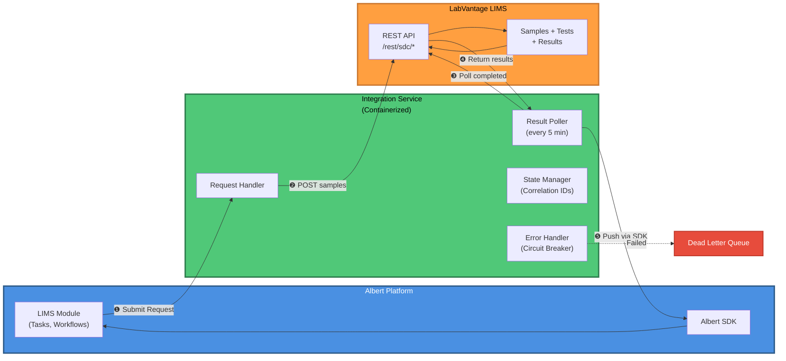
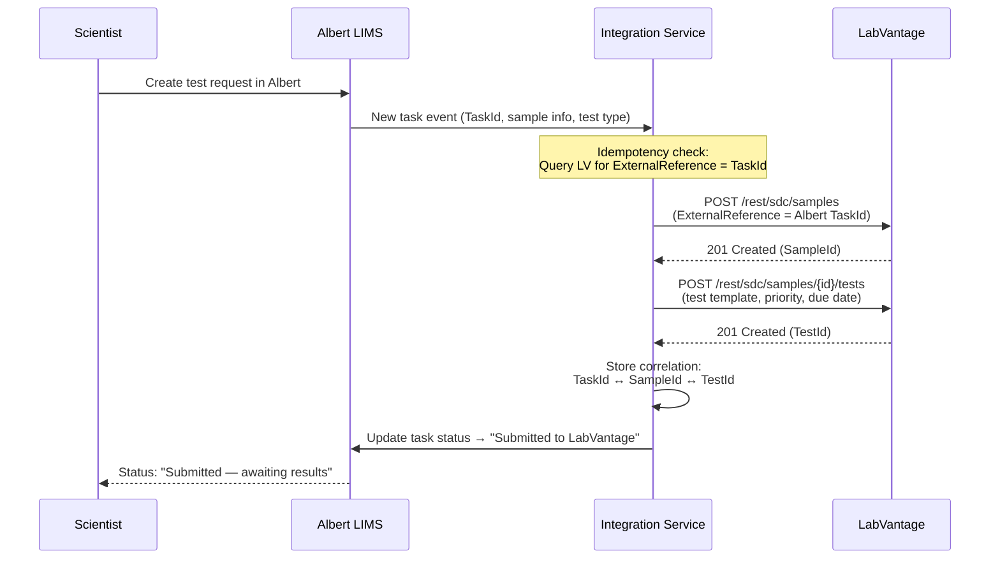
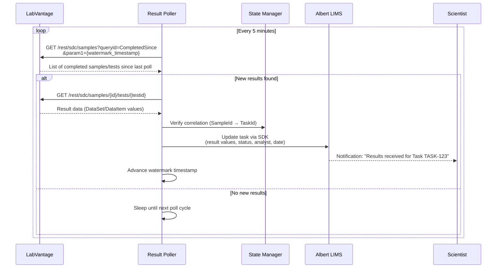
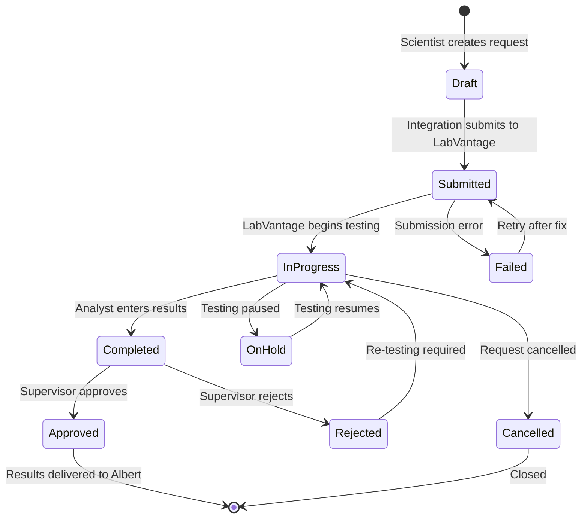

# Case Study Presentation Materials

**Presentation:** Principal Enterprise Engineer Case Study
**Audience:** Jim Smitley, VP of Engineering, Albert Invent
**Date:** Tuesday, February 17, 2026 at 2:00 PM ET (MS Teams)
**Total Duration:** 45 minutes prepared (+ 45 min cold deep-dive)

---

## Table of Contents

- [Cover Slide (for Gamma)](#cover-slide-for-gamma)
- [Acronym Quick Reference](#acronym-quick-reference)
- [SECTION 1: Estimate and Scoping](#section-1-estimate-and-scoping)
  - [Slide 1.1: My Approach](#slide-11-my-approach)
  - [Slide 1.2: The 4 Workstreams at a Glance](#slide-12-the-4-workstreams-at-a-glance)
  - [Slide 1.3: Initial Estimate Range](#slide-13-initial-estimate-range)
  - [Slide 1.4: Discovery — Getting to a Fixed Price](#slide-14-discovery--getting-to-a-fixed-price)
  - [Slide 1.5: Shared Risk Model — A Partnership](#slide-15-shared-risk-model--a-partnership)
  - [Slide 1.6: Top Risks I'd Flag Day One](#slide-16-top-risks-id-flag-day-one)
- [SECTION 2: LIMS Integration Plan](#section-2-lims-integration-plan)
  - [Slide 2.1: High-Level Assumptions](#slide-21-high-level-assumptions)
  - [Slide 2.2: Architecture Overview](#slide-22-architecture-overview)
  - [Slide 2.3: Outbound Flow — Request Submission](#slide-23-outbound-flow--request-submission)
  - [Slide 2.4: Inbound Flow — Result Retrieval](#slide-24-inbound-flow--result-retrieval)
  - [Slide 2.5: State Machine](#slide-25-state-machine)
  - [Slide 2.6: Error Handling & Resilience](#slide-26-error-handling--resilience)
  - [Slide 2.7: Why Custom Service, Not iPaaS](#slide-27-why-custom-service-not-ipaas)
  - [Slide 2.8: Unknowns to Validate in Discovery](#slide-28-unknowns-to-validate-in-discovery)
- [SECTION 3: Increasing Velocity Over Time](#section-3-increasing-velocity-over-time)
  - [Slide 3.1: The Philosophy](#slide-31-the-philosophy)
  - [Slide 3.2: Build → Refactor → Reuse](#slide-32-build--refactor--reuse)
  - [Slide 3.3: What a Connector Configuration Looks Like](#slide-33-what-a-connector-configuration-looks-like)
  - [Slide 3.4: Reusable Artifacts, Ranked by Impact](#slide-34-reusable-artifacts-ranked-by-impact)
  - [Slide 3.5: Resilient Workflows by Design](#slide-35-resilient-workflows-by-design)
  - [Slide 3.6: Who Benefits — Beyond Engineering](#slide-36-who-benefits--beyond-engineering)
- [APPENDIX: Backup Slides](#appendix-backup-slides)
  - [Backup A: Full Estimate Breakdown](#backup-a-full-estimate-breakdown)
  - [Backup B: SOW Phase Structure](#backup-b-sow-phase-structure)
  - [Backup C: Migration Cutover Strategy](#backup-c-migration-cutover-strategy)
  - [Backup D: Risk Register (Full)](#backup-d-risk-register-full)
  - [Backup E: Assumption Log](#backup-e-assumption-log)
  - [Backup F: RACI Matrix](#backup-f-raci-matrix)
  - [Backup G: Alternatives Considered](#backup-g-alternatives-considered)
  - [Backup H: The Scientist's Experience (Narrative)](#backup-h-the-scientists-experience-narrative)
  - [Backup I: Jim's Likely Questions — Prepared Answers](#backup-i-jims-likely-questions--prepared-answers)

---

## Cover Slide (for Gamma)

**Prompt for Gamma cover slide:**

```
Create a professional cover slide for a technical case study presentation:

Title: Principal Enterprise Engineer Case Study
Subtitle: Integration Platform Architecture & Estimation

Presented by: Damian Gonzalez
For: Jim Smitley, VP of Engineering
Company: Albert Invent
Date: February 17, 2026

Design notes:
- Clean, professional aesthetic (minimal, not flashy)
- Use a modern sans-serif font
- Neutral color palette (blues, grays - technical/engineering feel)
- Include subtle visual element suggesting connectivity/integration (optional: abstract network diagram or connection lines in background)
```

**Gamma Instructions:** Each `## Slide` header = one slide. Bullet points are slide content. `> Speaker Notes:` blocks are presenter notes. Diagrams marked `[MERMAID]` should be rendered as code blocks; diagrams marked `[EXCALIDRAW]` need manual creation. Keep slides visual — move dense content to speaker notes.

---

## Acronym Quick Reference

These acronyms appear throughout and are defined on first use in the slide content:

| Acronym | Meaning |
|---------|---------|
| ELN | Electronic Lab Notebook |
| LIMS | Laboratory Information Management System |
| CISPro | Chemical Inventory System Pro (Biovia product) |
| SOW | Statement of Work |
| ADF | Azure Data Factory |
| SDK | Software Development Kit |
| API | Application Programming Interface |
| DLQ | Dead Letter Queue |
| UAT | User Acceptance Testing |
| SME | Subject Matter Expert |
| T&M | Time and Materials |
| NTE | Not to Exceed |
| PERT | Program Evaluation and Review Technique (3-point estimation: Optimistic, Most Likely, Pessimistic → weighted average. Used to estimate work under uncertainty by capturing a range rather than a single number.) |

---

# SECTION 1: Estimate and Scoping

**Duration:** 15 minutes | **Slides:** 6 | **Pace:** ~2.5 min/slide

---

## Slide 1.1: My Approach

**Gamma Instructions:** 
- Layout: Title + 2-column layout + callout box at bottom
- Left column: "One-Time Migrations (Hard Deadline)" with bullet list
- Right column: "Ongoing Integrations (Long-Term Reliability)" with bullet list  
- Use icons: calendar/clock icon for migrations, infinity/gear icon for integrations
- Bottom: Large callout box with the one-sentence approach
- Color code: Red accent for "July 1 deadline", blue for integrations
- Keep it clean - minimize text density

**Title:** How I'd Approach This Engagement

**Content:**

The customer is asking for 4 things that break into 2 categories:

- **2 One-Time Migrations** with a hard July 1 deadline (Biovia ELN (Electronic Lab Notebook) and CISPro (Chemical Inventory System) subscriptions ending)
- **2 Ongoing Integrations** that need to be reliable and maintainable long-term (LIMS (Laboratory Information Management System) and Azure Data Platform)

My first move is NOT to estimate. It's to **separate what we know from what we don't know**.

**What we know:** The system landscape, directional requirements, the July 1 deadline
**What we don't know:** Data volumes, API (Application Programming Interface) capabilities, field-level mappings, data quality

**My approach in one sentence:**

*Establish a rough range to set budget expectations → run a focused discovery to narrow the range by 60% → commit to a fixed price for the well-defined work and T&M (Time and Materials) for the high-uncertainty work.*

> **Speaker Notes:** This is the 60-second opener. Set the frame before diving into numbers. Emphasize: "I'm not guessing — I'm being transparent about the uncertainty and proposing a process to resolve it." If Jim asks "why not just give a number?" — the answer is "I can give a range right now, but committing to a fixed price without discovery is how projects blow up. The discovery is how we protect both Albert and the customer."

---

## Slide 1.2: The 4 Workstreams at a Glance

**Gamma Instructions:**
- Layout: Simple data table (4 columns × 5 rows including header)
- Make the table prominent and easy to read
- Use alternating row colors for readability
- Bold the "Deadline" column header and July 1 dates
- Consider adding small icons in the "Type" column (file icon for migrations, sync icon for integrations)

**Title:** Four Workstreams, Two Categories

| # | Workstream | Type | Direction | Deadline |
|---|-----------|------|-----------|----------|
| 1 | ELN Migration (Biovia ELN → Albert Notebook) | One-time file migration | Inbound | **July 1** |
| 2 | LIMS Integration (LabVantage ↔ Albert LIMS) | Ongoing bidirectional | Bidirectional | Desired |
| 3 | Data Warehouse (Albert → Azure) | Ongoing outbound | Outbound | Flexible |
| 4 | Inventory Migration (CISPro → Albert Inventory) | One-time structured data | Inbound | **July 1** |

**Key insight:** Workstreams 1 and 4 are non-negotiable on timing (Biovia shuts off July 1). Workstreams 2 and 3 have more flexibility.

> **Speaker Notes:** Quick orientation — make sure Jim and I are looking at the same picture. Emphasize the July 1 hard deadline for migrations. This drives prioritization: if we're running behind, migrations come first.

---

## Slide 1.3: Initial Estimate Range

**Gamma Instructions:**
- Layout: Data table (5 columns × 6 rows including header)
- Use color coding: Green for optimistic, yellow for expected, red for pessimistic
- Add a visual indicator (bars or gradient) showing the range width
- Make the "Build Subtotal" row bold/distinct
- Below table: Add two smaller callout boxes for "Full program includes" and dollar range
- Keep numbers prominent and easy to scan

**Title:** Pre-Discovery Estimate (Build Phase Only)

| Workstream | Optimistic | Expected | Pessimistic | Key Assumption |
|-----------|-----------|----------|-------------|----------------|
| 1. ELN Migration | 4 pw | 7 pw | 12 pw | Biovia provides clean export; <50K files |
| 2. LIMS Integration | 16 pw | 22 pw | 32 pw | LabVantage API accessible; standard lifecycle |
| 3. Data Warehouse | 3 pw | 5 pw | 9 pw | Customer has established ADF (Azure Data Factory) patterns |
| 4. Inventory Migration | 6 pw | 10 pw | 16 pw | CISPro data is reasonably clean; <100K records |
| **Build Subtotal** | **29 pw** | **44 pw** | **69 pw** | |

*(pw = person-weeks)*

**Full program includes:** Discovery (3-4 pw), testing, deployment, and hypercare (2-4 pw/workstream)

**Full-loaded range: ~40-80 person-weeks** (~$250K-$500K at typical enterprise integration rates)

> **Speaker Notes:** CRITICAL: The s3 critique caught that the original LIMS optimistic (10 pw) was less than the PERT build-only estimate (12 pw). Fixed: optimistic is now 16 pw for the full LIMS lifecycle. The dollar range is at ~$200-250/hr blended customer-facing rate — adjust if Jim gives guidance on Albert's rate card. Emphasize these are PRE-DISCOVERY ranges. "Discovery narrows this by 40-60%." Be ready for Jim to push on the range width: "That 3:1 ratio means you don't know enough to commit, which is exactly why we need discovery."

---

## Slide 1.4: Discovery — Getting to a Fixed Price

**Gamma Instructions:**
- Layout: Split into three sections (top, middle, bottom)
- Top section: Timeline box showing "3-4 weeks" with team composition
- Middle: Two-column layout - "Discovery Deliverables" (left) and "Technical Spikes" (right) as bullet lists
- Bottom: Callout box for the fallback option ("If customer won't pay for discovery...")
- Use icons: magnifying glass for discovery, document for deliverables, wrench for technical spikes
- Keep visual hierarchy clear

**Title:** Discovery: From Range to Commitment

**Duration:** 3-4 weeks | **Team:** Principal Engineer (lead) + 1-2 integration engineers + customer technical leads

**Discovery Deliverables:**
- Technical Discovery Report (per workstream): API assessment, data quality, volume estimates
- Data Mapping Specifications: field-level source → target with transformation rules
- Architecture Diagrams: sequence flows, component diagrams, error handling
- Risk Register + Assumption Log: project-specific, not generic templates
- Detailed PERT Estimate: work-package level with contingency buffers
- Draft SOW (Statement of Work): phases, milestones, commercial terms

**Technical Spikes (run during discovery):**
- Biovia ELN export test: can we bulk-extract files? What format? What metadata?
- LabVantage API connectivity: can we authenticate, create a sample, read results?
- CISPro data extract: structured export, entity relationships, data quality
- Albert SDK (Software Development Kit) validation: does it support all required operations?

**If the customer won't pay for formal discovery:** Run a 1-week accelerated assessment at Albert's cost. Output: lighter-weight scope document with wider ranges. Price the implementation higher to account for remaining unknowns.

> **Speaker Notes:** Jim's Salesforce consultancy background means he's lived the "customer won't pay for discovery" scenario. Lead with the recommended approach (paid discovery), then have the fallback ready. The key message: "Discovery isn't overhead — it's risk reduction. A 3-week investment saves 6 weeks of rework." If he asks about the $40-60K price point: "That's the range for paid discovery. If we absorb it, it's an investment in the customer relationship — but we need to price the implementation accordingly."

---

## Slide 1.5: Shared Risk Model — A Partnership

**Gamma Instructions:**
- Layout: Four sections stacked vertically with white space between
- Section 1: "How We Partner" - 4 bullet points, SHORT phrases only (3-5 words each): "Joint discovery workshops", "Process mapping", "Strawman data mappings", "Weekly syncs"
- Section 2: "Customer Commitments" - numbered list 1-5, SHORT phrases (remove parenthetical details): "Named PM with authority", "API access within 2 weeks", "SME availability 0.5 FTE", "Test data within 3 weeks", "5-day feedback SLA"
- Section 3: "Timeline" - simple horizontal text: "Discovery → Design → Build → Test → Deploy | July 1 deadline"
- Section 4: "Triage Plan" - 3 items with traffic light colors: "Must: ELN + Inventory", "Can slip: Azure", "Should slip: LIMS"
- All bullets maximum 5-7 words - strip explanatory text and parentheticals
- Clean, scannable, minimal - presenter provides full detail verbally

**Title:** Making This Work: A Shared Risk Model

**How we partner with the customer:**
- Joint discovery workshops — we solve the "what data flows where" question together
- Process mapping as a forcing function: "Walk me through what happens when a scientist runs a test"
- Strawman data mappings — we propose, they react (faster than blank-canvas requirements)
- Weekly cross-workstream syncs throughout build

**What the customer must provide (top 5):**
1. Named project manager with decision authority — by kickoff
2. API access to LabVantage and Biovia systems — within 2 weeks of kickoff
3. SME (Subject Matter Expert) availability: 0.5 FTE per workstream during build
4. Representative test data — within 3 weeks of kickoff
5. Timely feedback: 5 business days on all deliverables

**Timeline from kickoff:**

```
Weeks:    0-4        4-7        7-16       16-18      18-20
          [Discovery] [Design]   [Build]    [Test+UAT] [Deploy]
                                                        ↑ July 1
          Migrations prioritized → build starts first
          LIMS parallel track → flexible go-live
```

**If July 1 is at risk, here's my triage:**
1. **Must ship:** ELN migration, Inventory migration (Biovia shuts off)
2. **Can slip to August:** Azure integration (existing patterns don't stop working)
3. **Should slip rather than rush:** LIMS integration (highest risk — better right than fast)

> **Speaker Notes:** Lead with PARTNERSHIP, not contracts. The SOW protections (scope freeze, change orders, deemed-accepted clauses) go in the appendix, not the main deck. Jim from Atlassian wants to see iterative delivery, not waterfall gates. Frame the timeline as "sprints within phases" — we can demo progress every 2 weeks. The triage plan shows you can make hard prioritization decisions. If Jim asks "what if even migrations are at risk?" — answer: "Descope to essentials. ELN: files only, no permission mapping or AI indexing in Phase 1. Inventory: substances and lots only, containers and pricing in Phase 2."

---

## Slide 1.6: Top Risks I'd Flag Day One

**Gamma Instructions:**
- Layout: Three risk boxes stacked vertically
- Each box contains: Risk title (bold), Impact statement, Mitigation approach
- Use warning icon (⚠️) or alert symbol for each risk
- Color code: Orange/yellow accent for risk boxes
- Keep text concise - this should be scannable in 10 seconds

**Title:** Three Risks I'd Raise Before We Start

**Risk 1: "We aren't sure what data needs to flow where"**
- The customer's own words signal they haven't done internal requirements analysis
- Impact: Discovery takes longer; scope creep risk is high
- Mitigation: Discovery process with process mapping and strawman proposals

**Risk 2: Biovia has no public APIs**
- Neither ELN nor CISPro have documented REST APIs for bulk extraction
- Impact: Migration approach depends on Pipeline Pilot or direct Oracle database access
- Mitigation: Technical spike in Week 1 of discovery to validate extraction path

**Risk 3: First-of-kind LIMS integration**
- If Albert has never integrated with LabVantage before, there's no reference architecture
- Impact: 25-35% contingency needed; expect unknowns during build
- Mitigation: Build clean, document everything, productize post-go-live (see Section 3)

> **Speaker Notes:** Keep this punchy — 3 risks, not 7. The full risk register and assumption log are in the backup slides. If Jim probes deeper on any risk, you have the detail. The goal here is to show you can identify the TOP risks and have a plan for each — not that you can list every possible thing that could go wrong. End Section 1 here. Transition: "Now let me dive into the most complex workstream — the LIMS integration."

---

# SECTION 2: LIMS Integration Plan

**Duration:** 20 minutes | **Slides:** 8 | **Pace:** ~2.5 min/slide

---

## Slide 2.1: High-Level Assumptions

**Gamma Instructions:**
- Layout: Numbered list (1-5) with assumption boxes
- Each box: Assumption statement in regular text
- Add visual emphasis: "Each assumption, if false, changes the architecture" as callout
- Use checkmark icons or numbered badges for the 5 assumptions
- Keep it clean and readable - this is a reference slide

**Title:** LIMS Integration — What I'm Assuming

1. **LabVantage REST API is enabled** and accessible from Albert's cloud infrastructure (not blocked by firewall or VPN)
2. **The customer has a LabVantage admin** who can configure server-side queries and RESTPolicy security rules (LabVantage uses deny-by-default — nothing is accessible until explicitly allowed)
3. **The integration scope is request/result exchange** — Albert submits test requests, LabVantage returns measured results. We are NOT migrating historical data or replacing LabVantage's UI.
4. **Lab test turnaround times are hours to days** — this justifies polling (every 5 min) rather than real-time event streaming
5. **Albert's LIMS module (Workflows, Tasks, Templates) has an API/SDK** that supports programmatic task creation and result attachment

**Each assumption, if false, changes the architecture.** These must be validated during discovery.

> **Speaker Notes:** Jim may challenge assumption #1 — "what if LabVantage is on-prem behind a firewall?" Answer: "Then we need a reverse proxy or VPN tunnel, which adds ~2 weeks to the timeline and changes the deployment model. This is why discovery includes a connectivity spike." Assumption #4 is the most important design decision: polling vs. real-time. Be ready to defend it: "Lab results take hours to days. Polling every 5 minutes means results appear in Albert within 5 minutes of completion. That's effectively real-time relative to the business process, without the complexity of event streaming."

---

## Slide 2.2: Architecture Overview

**Gamma Instructions:**
- Layout: Full-slide architecture diagram using the Mermaid code provided, the Speaker Notes and the excalidraw descriptions for guidance
- Primary focus: Show the 3-step flow clearly (1. Submit Request → 2. Poll Results → 3. Update Task)
- Three main boxes: Albert Platform (left), Integration Service (center), LabVantage LIMS (right)
- Integration Service internals: Show 4 components but SIMPLIFIED - just text labels, no heavy styling
- Use simple color blocks: Blue (Albert), Green (Integration Service), Orange (LabVantage)
- Add DLQ at bottom and Correlation IDs note at top, but make them SUBTLE (small text/icons)
- Remove decorative photo backgrounds and complex geometric shapes - keep it clean and technical
- The numbered flow (1→2→3) should be the visual anchor - make those arrows prominent
- Overall aesthetic: Clean technical diagram, not marketing material

**Title:** LIMS Integration Architecture

**[EXCALIDRAW — create manually as a spatial architecture diagram]**

**Description for manual creation:**

Draw 3 main boxes left-to-right:

**Left box: Albert Platform**
- Inside: "LIMS Module" (Workflows, Tasks, Templates)
- Below: "Albert SDK / API"
- Color: Blue

**Center box: Integration Service** (the component WE build)
- Inside, stacked vertically:
  - "Request Handler" (outbound)
  - "Result Poller" (inbound, runs every 5 min)
  - "State Manager" (correlation IDs, status tracking)
  - "Error Handler" (circuit breaker, retry, DLQ (Dead Letter Queue))
- Below the box: "Monitoring + Alerts" (Prometheus/Grafana or CloudWatch)
- Color: Green
- Note: containerized, deployed in Albert's infrastructure

**Right box: LabVantage LIMS**
- Inside: "Samples, Tests, Results"
- Below: "REST API (`/rest/sdc/{resource}`)"
- Color: Orange

**Arrows:**
- Albert → Integration Service: "Submit test request" (solid arrow)
- Integration Service Poller → LabVantage: "POST /rest/sdc/samples" (solid arrow, labeled "1. Create Sample + Test")
- Integration Service Poller → LabVantage: "GET /rest/sdc/samples/{id}/tests" (dashed arrow, labeled "2. Poll for results every 5 min")
- LabVantage → Integration Service: "Completed results" (dashed arrow back)
- Integration Service POller → Albert: "Push results via SDK" (solid arrow, labeled "3. Update Albert Task")

**Bottom: Dead Letter Queue** — failed messages land here for manual review
**Top: Correlation IDs** — Albert TaskId ↔ LabVantage SampleId (ExternalReference field)

**[MERMAID — data flow overview for the markdown/slide]**



> **Speaker Notes:** This is the centerpiece slide. Spend 3-4 minutes here. Walk through the 3 numbered steps: (1) request submission, (2) result polling, (3) result delivery back to Albert. Emphasize the Integration Service is a component Albert owns — deployed as a container in Albert's cloud, not third-party middleware. The DLQ catches anything that fails after retries — nothing gets silently dropped. Show code-level thinking: "The poller uses Albert's Python SDK: `albert.lims.tasks.list(status='pending_results')` to find tasks waiting for results, then queries LabVantage: `GET /rest/sdc/samples/{id}/tests?queryid=CompletedResults`."

---

## Slide 2.3: Outbound Flow — Request Submission

**Gamma Instructions:**
- Layout: Full-slide sequence diagram (use the Mermaid diagram provided)
- If Mermaid doesn't render well, create simplified version as vertical flow diagram
- Show flow top-to-bottom: Scientist → Albert → Integration Service → LabVantage
- Use arrows with labels for each step
- Highlight the "Idempotency check" step with a callout box
- Below diagram: Key design decisions as 3 bullet points
- Keep it visual - minimize text outside the diagram

**Title:** Outbound: Submitting a Test Request

**[MERMAID — sequence diagram]**



**Key Design Decisions:**
- **Idempotency:** Before creating a sample in LabVantage, check if ExternalReference already contains this Albert TaskId. If yes, skip creation — prevents duplicate submissions on retry.
- **Non-atomic creation:** LabVantage requires separate POST calls for samples and tests (can't create both atomically). If sample creation succeeds but test creation fails → retry test creation using the existing SampleId. If that fails → route to DLQ for manual resolution.
- **Correlation:** Albert TaskId stored as LabVantage ExternalReference field. This is the linkage key for all subsequent operations.

> **Speaker Notes:** Walk through the sequence top-to-bottom. Emphasize idempotency: "If the integration service crashes after creating the sample but before recording the correlation, the retry will check LabVantage first — 'does a sample with ExternalReference=TASK-123 already exist?' If yes, skip to test creation." The non-atomic creation issue is a real LabVantage API limitation — naming it shows you've done your research. Jim may ask: "Why not use the LabVantage Actions API for atomic creation?" Answer: "That's an option worth exploring in discovery — the Actions API invokes the same business logic as the UI and may support atomic sample+test creation. We'd validate this during the API connectivity spike."

---

## Slide 2.4: Inbound Flow — Result Retrieval

**Gamma Instructions:**
- Layout: Full-slide sequence diagram showing polling loop (use Mermaid diagram)
- Emphasize the "Every 5 minutes" loop at the top
- Show two paths: "New results found" (green) vs "No new results" (gray)
- Below diagram: Two callout boxes side-by-side:
  - Left: "Why polling at 5 minutes?" with 4 bullet reasons
  - Right: "Watermark-based deduplication" explanation
- Make the diagram prominent, supporting text smaller

**Title:** Inbound: Receiving Test Results

**[MERMAID — sequence diagram]**



**Why polling at 5 minutes, not real-time streaming:**
- Lab test turnaround = hours to days. 5-min polling = results appear in Albert within 5 minutes of completion.
- LabVantage has **no native webhooks** — there's no push notification mechanism
- Polling is simpler to build, test, debug, and operate than event streaming
- 5-min interval = ~288 API calls/day — well within any reasonable rate limit

**Watermark-based deduplication:** The poller tracks the timestamp of the last processed result. Each poll asks: "give me everything completed since X." This ensures no results are missed and no duplicates are processed.

> **Speaker Notes:** The polling justification is one of the strongest parts of the design. If Jim challenges it ("why not real-time?"), the answer is: "The business process is inherently batch — tests take hours to days. Real-time would add complexity (event bus, webhook infrastructure, guaranteed delivery) for zero business value. The 5-minute poll is effectively instant relative to the scientist's workflow." The watermark pattern is the standard approach for incremental polling — same pattern ADF uses for data lake extraction.

---

## Slide 2.5: State Machine

**Gamma Instructions:**
- Layout: Full-slide state diagram (use Mermaid diagram)
- Show main happy path states prominently (Draft → Submitted → InProgress → Completed → Approved)
- Show exception paths (Failed, OnHold, Rejected, Cancelled) in lighter color or dashed lines
- Below diagram: Data table showing state mappings between Albert and LabVantage (4-5 key states)
- Use color coding: Green for completed states, yellow for in-progress, red for error states
- Make transitions clear with labeled arrows

**Title:** Test Request Lifecycle

**[MERMAID — state diagram]**



**States tracked in both Albert and LabVantage:**

| State | Albert Status | LabVantage Status | Trigger |
|-------|-------------|-------------------|---------|
| Draft | Task created | — | Scientist creates request |
| Submitted | "Submitted" | Sample + Test created | Integration service POST succeeds |
| In Progress | "In Progress" | Test assigned to analyst | Poller detects status change |
| Completed | "Results Received" | Test results entered | Poller retrieves result data |
| Approved | "Approved" | Supervisor sign-off | Poller detects approval |
| On Hold / Rejected / Cancelled | Synced from LV | Set by LV user | Poller detects status change |
| Failed | "Submission Error" | — | Integration service POST fails |

> **Speaker Notes:** The original design had only 4 states. The critique correctly identified that real LIMS workflows include Cancelled, Rejected, On Hold. Including these shows you understand the domain, not just the happy path. If Jim asks about the "Rejected → In Progress" loop: "This happens when a supervisor reviews the result and sends it back for re-testing. The poller detects the status change in LabVantage and updates Albert's task accordingly. The scientist sees 'Re-testing Required' in their Albert dashboard."

---

## Slide 2.6: Error Handling & Resilience

**Gamma Instructions:**
- Layout: Top 2/3 is data table (5 failure modes), bottom 1/3 is observability section
- Table: 5 columns (Failure | Detection | Response) with numbered rows (1-5)
- Use icons for each failure type (cloud-off for downtime, duplicate for duplicate submission, etc.)
- Below table: "Observability" section with 3 bullet points and dashboard icons
- Keep table text concise - use short phrases, not full sentences
- Color code responses: green for auto-recovery, yellow for retry, red for alert/manual

**Title:** What Happens When Things Break

**Top 5 Failure Modes and Mitigations:**

| # | Failure | Detection | Response |
|---|---------|-----------|----------|
| 1 | **LabVantage is down** | HTTP 503 / connection timeout | Circuit breaker trips after 3 failures. Outbound requests queue in DLQ. Poller pauses. Auto-retry when LV returns. Scientist sees "Pending — will retry." |
| 2 | **Duplicate submission** (retry after ambiguous failure) | Idempotency check: query LV for ExternalReference = TaskId before creating | If sample exists, skip creation. Link to existing SampleId. |
| 3 | **Network partition** (sample created, correlation not saved) | Reconciliation job runs hourly: queries LV for samples with ExternalReference matching Albert TaskIds, fills gaps | Orphaned samples in LV detected and linked. Alert on mismatch count > 0. |
| 4 | **Result pushed to wrong Albert task** | Correlation check: every result validated against TaskId ↔ SampleId mapping | If mismatch detected, route to DLQ. Alert for manual review. Never auto-update on mismatch. |
| 5 | **Albert is down** (results complete in LV, can't push) | Poller health check fails | Results accumulate. On recovery, watermark-based catch-up processes all missed results. No data loss. |

**Observability:**
- Health check endpoint for the integration service
- Dashboard: request volume, success rate, DLQ depth, poll latency, error rate
- Alerts: DLQ depth > 0, circuit breaker tripped, poll failure streak > 3

> **Speaker Notes:** This slide addresses the s3 critique's most pointed feedback: "name 10 failure modes, solve 5." We're naming 5 and solving all 5. Jim may probe failure modes #3 and #4, which are the most subtle.
>
> **Failure Mode #3: Network Partition** — This is the nastiest distributed systems failure. Here's the scenario: The integration service successfully POSTs a sample to LabVantage and gets back a 201 Created with a SampleId. But before it can persist the correlation mapping (TaskId ↔ SampleId) to its database, the network connection drops or the integration service crashes. Now we have an orphaned sample in LabVantage with no way to correlate it back to the Albert task. The reconciliation job is our safety net: it runs hourly and queries LabVantage for all samples where ExternalReference matches an Albert TaskId pattern. It cross-references this against our correlation table. If it finds a sample in LabVantage with an ExternalReference that matches a TaskId but isn't in our correlation table, it auto-repairs the mapping. If there are multiple samples with the same ExternalReference (shouldn't happen, but possible if idempotency check failed), it alerts for manual review. Show builder instinct: "I'd implement the reconciliation job as a separate scheduled task with its own cron schedule, not part of the main poller, so it can run independently and won't be affected if the poller is down."
>
> **Failure Mode #4: Result Pushed to Wrong Task** — This is a data integrity failure. Scenario: The correlation mapping gets corrupted (database bug, manual edit gone wrong, race condition). The poller retrieves a result for SampleId 12345 from LabVantage. It looks up the correlation table and finds TaskId ABC-789. But the actual correct TaskId should be ABC-456. If we blindly push that result to the wrong task, we've just contaminated scientific data — a scientist sees test results that aren't theirs. This is catastrophic for a lab. The mitigation: every result retrieved from LabVantage includes the ExternalReference field, which stores the original Albert TaskId. Before pushing the result via the SDK, we validate: does the ExternalReference in the LabVantage response match the TaskId from our correlation lookup? If not, it's a data integrity violation. Route to DLQ, alert immediately for manual investigation. Never auto-update on mismatch. Show domain understanding: "In a lab, data integrity violations are worse than downtime. Better to have missing results and manual investigation than wrong results delivered silently."

---

## Slide 2.7: Why Custom Service, Not iPaaS

**Gamma Instructions:**
- Layout: Split slide - left side "Why not iPaaS?", right side "Why custom works"
- Use two-column comparison with bullet lists
- Left column (iPaaS): Use red X or minus icons for each point
- Right column (Custom): Use green checkmark or plus icons for each point
- Add visual: Small cost comparison callout showing "$36-180K/year" for iPaaS vs "own the IP" for custom
- Keep it simple - this should be a quick 60-second slide

**Title:** Integration Approach Decision

**Recommendation: Custom Python integration service** deployed as a container in Albert's infrastructure.

**Why not iPaaS (Integration Platform as a Service, e.g., MuleSoft, Boomi)?**
- No pre-built LabVantage connector exists in any major iPaaS — we'd still build custom adapters
- iPaaS licensing: $36K-$180K+/year — cost without proportional value
- The hard problems (polling, state management, idempotency) aren't easier through iPaaS
- **Albert doesn't own the IP** — every integration built on iPaaS is locked to that vendor
- Doesn't contribute to AlbertHub productization (see Section 3)

**Why custom works:**
- Albert owns the code, the IP, and the operational knowledge
- Python + Albert SDK + LabVantage REST API = well-understood tech stack
- Containerized deployment = portable, scalable, testable
- First integration becomes the reference implementation for the connector framework

> **Speaker Notes:** Keep this to 60 seconds. Don't over-explain the alternatives — Jim will ask if he wants to explore them. The key point: "iPaaS adds cost and vendor lock-in without solving the hard problems. The hard problems are LabVantage's non-standard API, the bidirectional state management, and the no-webhook constraint. Those are the same problems regardless of middleware." If Jim pushes: "When WOULD you use iPaaS?" — "If the customer already has and operates an iPaaS and insists on routing all integrations through it. Then it's their infrastructure choice, not ours."

---

## Slide 2.8: Unknowns to Validate in Discovery

**Gamma Instructions:**
- Layout: Checklist style with 6 items (use checkbox icons, all unchecked)
- Each item: Question to answer with brief context in smaller text
- Use question mark icons or discovery/magnifying glass theme
- Bottom callout: Transition statement "and that's why we need discovery"
- Keep it clean and scannable - this wraps up Section 2

**Title:** What Discovery Must Answer for LIMS

- [ ] **Network path:** Is LabVantage on-prem or cloud-hosted? Can Albert reach it?
- [ ] **API capabilities:** Is REST API enabled? What named queries exist? Can we create samples/tests via REST or must we use Actions API?
- [ ] **RESTPolicy configuration:** LabVantage uses deny-by-default security. Who configures it? How long does it take?
- [ ] **Data mapping:** What fields are required for sample/test creation? What custom fields does the customer use?
- [ ] **In-flight requests:** When the integration goes live, how do we handle test requests already in LabVantage? Ignore? Backfill?
- [ ] **LabVantage version:** REST API capabilities vary by version. Which version does the customer run?

> **Speaker Notes:** This slide transitions naturally to "and that's why we need discovery." Each unknown, if resolved unfavorably, changes the architecture. If Jim asks about in-flight requests: "This is a go-live sequencing question. Options: (1) clean cutover — all new requests go through Albert from day one, existing requests finish in LabVantage only; (2) backfill — we query LabVantage for all open requests and create matching tasks in Albert. I'd recommend option 1 for simplicity, but it depends on how many requests are in flight at cutover." End Section 2 here. Transition: "Now that we've designed the first LIMS integration — how do we make the second one faster?"

---

# SECTION 3: Increasing Velocity Over Time

**Duration:** 10 minutes | **Slides:** 5 | **Pace:** 2 min/slide

---

## Slide 3.1: The Philosophy

**Gamma Instructions:**
- Layout: Three-part visual (Problem → Mindset Shift → Vision)
- Top: "The problem today" with 3 bullet pain points (use warning icons)
- Middle: "The mindset shift" with numbered 2-item list (1. working integration, 2. reusable artifact)
- Bottom: Highlighted callout: "This is the core of the AlbertHub vision"
- Use visual progression: Problem (red) → Shift (yellow) → Vision (green)
- Keep text minimal - this is a philosophical framing slide

**Title:** Build the Integration Factory, Not Just Integrations

**The problem today:**
- Every new customer integration is built from scratch
- Engineering time scales linearly with customer count
- Knowledge stays in individual engineers' heads

**The mindset shift:**
- Every customer engagement leaves behind TWO things:
  1. A working integration for THAT customer
  2. A reusable artifact that makes the NEXT customer faster

**This is the core of the AlbertHub vision** — turning bespoke engineering into repeatable, productized capabilities.

> **Speaker Notes:** This framing directly addresses the JD language: "Convert ad-hoc engineering work into reusable frameworks, configuration-driven features, and self-service tooling." Don't just say "productization" — show you understand WHAT it means in this context. The key phrase: "We're not building integrations — we're building the integration factory." This is the kind of soundbite Jim will remember.

---

## Slide 3.2: Build → Refactor → Reuse

**Gamma Instructions:**
- Layout: Three horizontal phases shown as connected blocks/steps
- Phase 1 (left): "Build" - bullet list with effort estimate
- Phase 2 (middle): "Refactor" - bullet list with investment estimate  
- Phase 3 (right): "Reuse" - bullet list with time savings (60% reduction, 55% total reduction)
- Use arrow connections between phases
- Highlight the savings numbers in green with percentage badges
- Bottom: Key insight callout about "don't know the right abstractions until we've built the first one"

**Title:** The Three-Phase Productization Strategy

**Phase 1: Build (This customer)**
- Custom Python integration service for LabVantage ↔ Albert
- Clean architecture: separate concerns (polling, mapping, error handling, monitoring)
- ~16-22 person-weeks for the LIMS build

**Phase 2: Refactor (After go-live)**
- Extract generic components into a shared framework: scheduler, retry engine, DLQ, monitoring, health checks
- Extract LabVantage-specific logic into a `LabVantageAdapter`
- Extract field mappings into YAML configuration files
- ~4-6 person-weeks of investment

**Phase 3: Reuse (Next customer)**
- New LabVantage customer = new YAML config + testing
- New LIMS platform (e.g., STARLIMS) = new adapter + config + testing
- **Build phase drops from ~16 weeks to ~6 weeks (~60% reduction)**
- Total engagement drops from ~22 weeks to ~10 weeks (~55% reduction)

> **Speaker Notes:** The s3 critique caught that the original "2-3 weeks" claim was unjustified. Corrected to a defensible ~60% reduction on build, ~55% on total engagement. The key insight: "We don't know the right abstractions until we've built the first one. Premature abstraction would mean guessing which parts are generic vs customer-specific. After go-live, we KNOW." If Jim asks "why not build the framework first?" — "Because premature abstraction is more expensive than refactoring. We'd guess wrong about what's generic, build the wrong framework, then rebuild it after the first customer teaches us what's really reusable."

---

## Slide 3.3: What a Connector Configuration Looks Like

**Gamma Instructions:**
- Layout: Large code block (YAML) taking up 60% of slide, explanation box below
- Display the YAML config as monospace/code font with syntax highlighting if possible
- Use muted background for code block (light gray)
- Below code: Single callout box explaining "What this means"
- Keep surrounding text minimal - the YAML example is the star here
- Consider adding small icons for each YAML section (connection=plug, polling=clock, mapping=arrows, error=shield)

**Title:** Configuration-Driven, Not Code-Driven

**Sample connector config (YAML):**

```yaml
connector:
  name: customer-acme-labvantage
  type: labvantage
  version: "8.7"

connection:
  host: lv.acme.com
  port: 8443
  auth:
    type: external_app_user
    credentials_secret: acme-lv-credentials

polling:
  interval_seconds: 300
  result_query: "CompletedResultsSinceTimestamp"
  watermark_field: "completiondate"

field_mapping:
  outbound:
    albert_task_id: ExternalReference
    sample_type: s_sampletype
    test_template: testtemplateid
    priority: priority
  inbound:
    result_value: measured_value
    result_unit: unit
    test_status: task_status
    analyst: completed_by

error_handling:
  max_retries: 3
  backoff_multiplier: 2
  circuit_breaker_threshold: 5
```

**What this means:** New customer = write a config file like this + run the test harness. No code changes to the core framework.

> **Speaker Notes:** This is the "show, don't tell" moment. Jim is a builder — a concrete config file is 10x more persuasive than saying "YAML configuration files." Walk through the sections: "Connection defines how to reach LabVantage. Polling defines how often and what query. Field mapping defines how Albert fields translate to LabVantage fields. Error handling defines resilience parameters. Every section is customer-specific but the STRUCTURE is universal." If Jim asks "what about custom logic that can't be expressed in config?" — "That's what the adapter is for. The config handles 80% of variation. The adapter handles the remaining 20% per LIMS platform."

---

## Slide 3.4: Reusable Artifacts, Ranked by Impact

**Gamma Instructions:**
- Layout: Top: Data table with 4 columns (Priority | Artifact | What It Is | Reuse Likelihood)
- Use visual priority indicators: #1 with star/medal icon, #2-#6 with numbered badges
- Color code "Reuse Likelihood": Dark green for High, yellow for Medium
- Bottom: Code-style box showing the LIMSConnector interface (5 methods in monospace font)
- Make priority column stand out - this is the key insight (ranked by ACTUAL value)

**Title:** Six Artifacts, Ranked by Actual Reuse Value

| Priority | Artifact | What It Is | Reuse Likelihood |
|----------|----------|-----------|-----------------|
| **1** | **Connector Framework + Templates** | Shared code: scheduler, retry, DLQ, monitoring. Boilerplate for new adapters. | **High** — the core of productization |
| **2** | **Field Mapping Configs** | YAML files per customer (see previous slide) | **High** — new customer = new config file |
| **3** | **Contract Test Harness** | Automated tests that validate ANY `LIMSConnector` implementation against the interface contract | **High** — customer-independent, catches regressions |
| **4** | **Deployment Playbooks** | Step-by-step: provision environment, configure secrets, deploy container, validate health | **Medium** — useful early, evolves into automation |
| **5** | **Monitoring Runbooks** | Standard dashboards and alert rules: DLQ depth, error rate, poll latency | **Medium** — generic monitoring is reusable; thresholds are per-customer |
| **6** | **Developer Documentation** | How to build a new adapter, framework internals, API reference | **Medium** — high value IF maintained |

**The `LIMSConnector` interface (what every adapter must implement):**
- `authenticate()` — connect to the external LIMS
- `submit_request(task)` — create a sample/test in the external LIMS
- `poll_results(since)` — retrieve completed results since a watermark
- `map_inbound(raw_result)` → Albert result format
- `map_outbound(albert_task)` → LIMS request format

> **Speaker Notes:** The critique pointed out the original 6-artifact list "reads like a consultant's slide." Ranking by reuse likelihood shows you know the difference between theory and practice. The LIMSConnector interface definition shows you've thought about the abstraction, not just named it. Jim may ask: "How does this handle a LIMS with SOAP instead of REST?" — "The adapter pattern abstracts the protocol. LabVantageAdapter uses REST. A hypothetical LabWareAdapter would use SOAP. The framework doesn't care — it calls authenticate(), submit_request(), poll_results(). The adapter translates those to protocol-specific calls."

---

## Slide 3.5: Resilient Workflows by Design

**Gamma Instructions:**
- Layout: Top: 2-column comparison (left: "What We Build for Customer 1", right: "What Temporal Gives Us at Scale")
- Left column: 4 bullet items showing custom-built components (muted color)
- Right column: 4 matching bullet items showing Temporal equivalents (bright/green color)
- Use matching arrows or connecting lines between left and right to show the 1:1 mapping
- Middle: Single callout box with the key insight ("purpose-built for exactly this problem")
- Bottom: "When to make this move" as a short 2-line statement
- Keep it visual and scannable. This is a 60-second slide, not a deep dive.

**Title:** Long-Running Workflows Deserve a Purpose-Built Engine

**The integration workflows we're building (polling loops, retry chains, multi-day test lifecycles) are textbook long-running workflows.** These are solved problems with purpose-built open source tooling.

**Temporal** is an open-source workflow engine built specifically for this problem:

| Without Temporal (Custom Orchestration) | With Temporal |
|-------------------------------|-------------------------------|
| Custom polling loop + watermark catch-up | Durable timers that survive restarts |
| Retry logic with exponential backoff | Configurable activity retry policies |
| State machine tracking request lifecycle | Workflow state persisted automatically |
| Reconciliation job for crash recovery | Automatic checkpoint and resume |
| DLQ + manual review process | Built-in failure queue with full execution history |

**Key insight:** Every component in the left column is code we'd write, test, and maintain ourselves. The right column is battle-tested infrastructure used in production at Stripe, Netflix, and Datadog. Adopting Temporal means our engineers focus on what's actually unique to Albert: the LIMS adapters and data mappings, not orchestration plumbing.

**The decision depends on the team.** If Albert has experience with Temporal (or is ready to invest in it), this is a day-one choice. If the team hasn't operated Temporal before, a custom implementation for the first engagement is a reasonable starting point, with Temporal adoption as a near-term evolution.

> **Speaker Notes:** Keep this to 60 seconds. The goal is to present Temporal as the natural fit for the problem, not a future aspiration. The left column of the table is real engineering work that someone has to build, test, debug, and maintain. The right column is infrastructure that already exists. Frame it as a build-vs-buy decision: "We can write all of this ourselves, and it will work. But these are solved problems. Temporal exists specifically for long-running, multi-step workflows with retry and crash recovery. That's exactly what LIMS integrations are." If Jim asks "why Temporal specifically?" — "It's open source, has strong Java and Python SDKs, runs self-hosted or as managed cloud (Temporal Cloud), and is proven at Stripe, Netflix, and Datadog for exactly this kind of orchestration." If Jim asks "why not just use it from day one?" — "If the team is comfortable with it, I would. The patterns map directly. The only reason to start with custom code is if the team hasn't operated Temporal before and doesn't want two unknowns on the first engagement. But either path works — the connector logic and data mappings are the same regardless of the orchestration layer." If Jim asks "what's the adoption cost?" — "2 to 3 weeks to integrate the Temporal SDK. The connector logic and YAML configs don't change. The main investment is deploying the Temporal server or subscribing to Temporal Cloud. The payoff: every connector we build inherits durable execution, retry, and observability for free."

---

## Slide 3.6: Who Benefits — Beyond Engineering

**Gamma Instructions:**
- Layout: Top: Progression table (4 columns × 5 rows) showing Today vs Tomorrow for each role
- Use before/after visual metaphor with muted colors for "Today", bright colors for "Tomorrow"
- Add icons for each role (Engineering=code, Tech Ops=gears, CS=people, Partners=handshake, Customers=star)
- Middle: Large callout: "This is the AlbertHub vision" with JD reference
- Bottom: "How I'd share across the team" with 4 concrete mechanisms as bullet list
- Keep visual - minimize text density

**Title:** From Engineering Tool to Platform Capability

**The progression across the org:**

| Role | Today (Bespoke) | Tomorrow (Productized) |
|------|-----------------|----------------------|
| **Engineering** | Builds every integration from scratch | Builds adapters and framework; reviews configs |
| **Tech Ops** | Waits for engineering | Deploys connectors using playbooks; monitors dashboards |
| **Customer Success** | Escalates every integration request | Configures field mappings in YAML; runs test harness |
| **Partners / SIs (System Integrators)** | Can't participate | Builds adapters using documentation and SDK |
| **Customers** | Waits weeks for connectivity | (Future: self-service via AlbertHub UI) |

**This is the AlbertHub vision:** the connectivity and automation backbone from the JD (Job Description). Each layer of productization unblocks the next group of people.

**How I'd share across the team:**
- Internal demo after each major milestone (biweekly)
- Documentation published to Albert's developer portal
- "Integration Office Hours" — weekly slot for CS/Tech Ops questions
- Post-mortem after first customer go-live → lessons learned feed back into playbooks

> **Speaker Notes:** This slide directly addresses the JD: "Define guardrails, best practices, and operational processes that enable Customer Success, Tech Ops, and partners to deliver solutions consistently without bespoke engineering involvement." Jim is hiring someone to build this vision. The progression table shows you understand the end state — not just the first step. End Section 3 here. If there's time, close with: "The first customer is an investment. The framework makes every subsequent customer faster, cheaper, and deliverable by a wider set of people. That's how we scale."

---

# APPENDIX: Backup Slides

*These slides are NOT part of the main presentation. They contain detail that supports the main deck if Jim probes deeper during Q&A.*

---

## Backup A: Full Estimate Breakdown

**Full-Loaded Program Estimate:**

| Component | Optimistic | Expected | Pessimistic |
|-----------|-----------|----------|-------------|
| Discovery (shared) | 3 pw | 3 pw | 4 pw |
| WS1: ELN Migration (build) | 4 pw | 7 pw | 12 pw |
| WS2: LIMS Integration (build) | 16 pw | 22 pw | 32 pw |
| WS3: Data Warehouse (build) | 3 pw | 5 pw | 9 pw |
| WS4: Inventory Migration (build) | 6 pw | 10 pw | 16 pw |
| Testing + UAT (all) | 4 pw | 8 pw | 12 pw |
| Deployment + Cutover | 2 pw | 4 pw | 6 pw |
| Hypercare (4 workstreams × 2-4 pw) | 8 pw | 12 pw | 16 pw |
| **TOTAL PROGRAM** | **46 pw** | **71 pw** | **107 pw** |
| At ~$225/hr blended | **~$414K** | **~$639K** | **~$963K** |

**Commercial model recommendation:**
- Discovery: Fixed price
- Migrations (WS1, WS4): Fixed price post-discovery
- LIMS (WS2): T&M with NTE (Not to Exceed) cap
- Azure (WS3): Fixed price
- Hypercare: Included for migrations; SLA contract for integrations

---

## Backup B: SOW Phase Structure

```
Phase 0: Discovery       → Deliverables: tech report, data mappings, architecture, estimate, risk register
Phase 1: Design          → Deliverables: architecture doc, data mapping spec, env setup
Phase 2: Build           → Deliverables: working pipeline, error handling, code review, runbook draft
Phase 3: Test            → Deliverables: test report, UAT sign-off, performance results
Phase 4: Deploy          → Deliverables: production deployment, migration validation report
Phase 5: Hypercare       → Deliverables: stability report, issue log, support handoff
```

**Go/No-Go gates between each phase:** scope signed, APIs verified, architecture approved, tests passing, UAT signed off.

---

## Backup C: Migration Cutover Strategy

**For ELN and Inventory Migrations (July 1 deadline):**

**T-minus 4 weeks:** Bulk extraction to staging area (S3/Azure Blob for files, PostgreSQL for structured data)

**T-minus 2 weeks:** Staging area complete. Customer validates: file count matches, data quality report reviewed, sample spot-checks passed.

**T-minus 1 week:** Load to Albert production. Verify all records accessible. Run automated comparison (source count = target count, checksum validation for files).

**T-minus 2 days:** Freeze period — no new data entered in Biovia. Final delta extraction for anything added since bulk extraction.

**Cutover day (July 1):** Final delta loaded. Validation gate: counts, checksums, access controls verified. Customer signs off. Biovia decommissioned.

**Rollback plan:** If critical issues found after cutover, staging area is intact. Can re-extract from staging to Albert (no dependency on Biovia post-July-1).

---

## Backup D: Risk Register (Full)

| ID | Risk | Probability | Impact | Mitigation |
|----|------|------------|--------|------------|
| R1 | Customer hasn't defined data requirements ("we aren't sure") | High | High (scope creep) | Discovery with process mapping; strawman proposals |
| R2 | Biovia has no public APIs for export | Medium | High (schedule) | Technical spike in Week 1; plan for Oracle DB extraction |
| R3 | CISPro data quality is poor | High | High (rework) | Data quality report in staging; customer review before load |
| R4 | LabVantage API doesn't support required operations | Medium | Critical | Discovery API spike; escalation to LabVantage support |
| R5 | Customer can't provide test environments on time | Medium | High (schedule) | Contractual prerequisite; day-for-day extension clause |
| R6 | July 1 not achievable for all 4 workstreams | Medium | Critical | Prioritize migrations; phased go-live for integrations |
| R7 | First-of-kind LIMS integration — no reference arch | High | High (effort) | 30% contingency; post-project productization |

---

## Backup E: Assumption Log

| ID | Assumption | If False |
|----|-----------|----------|
| A1 | ELN files <100K total, <500GB | Volume changes timeline; need parallel processing |
| A2 | LabVantage REST API accessible from cloud | Firewall/VPN changes architecture significantly |
| A3 | Customer has LabVantage admin for RESTPolicy config | Without this, API access blocked (deny-by-default) |
| A4 | Albert SDK supports all required operations | Platform gaps require SDK enhancement or API workarounds |
| A5 | Customer provides 0.5 FTE SME per workstream | Data mapping and UAT stall without customer input |
| A6 | Biovia contracts allow data extraction pre-expiry | Legal review needed; could block migration |

---

## Backup F: RACI Matrix

| Activity | Albert PE | Albert Devs | Albert CS/Tech Ops | Albert Product | Customer PM | Customer IT | Customer SMEs |
|----------|-----------|-------------|-------------------|---------------|-------------|-------------|---------------|
| Project governance | A | I | I | I | R | I | I |
| Discovery workshops | R | C | C | C | A | R | R |
| Architecture design | A/R | R | I | C | I | C | I |
| Build integration | A | R | I | C (SDK gaps) | I | C | — |
| Testing | A | R | C (runbooks) | I | I | R | C |
| UAT | C | C | I | I | A | C | R |
| Deployment | A | R | R (ops handoff) | I | I | R | I |
| Hypercare | A | R | R (monitoring) | I | I | R | R |

R = Responsible, A = Accountable, C = Consulted, I = Informed

---

## Backup G: Alternatives Considered

**LIMS: iPaaS (MuleSoft/Boomi)**
- Rejected: $36-180K+/yr licensing, no pre-built LV connector, doesn't solve hard problems, Albert doesn't own IP

**ELN Migration: Streaming Pipeline (no staging)**
- Rejected: No safety net for hard deadline. If upload fails after Biovia decommissioned, data is lost.

**Inventory: Direct SDK Import (no staging DB)**
- Rejected: Data quality issues hit production directly. No customer review checkpoint.

**Azure: Vendor-Push (Albert writes to customer storage)**
- Rejected: Requires WRITE access to customer Azure — security concern for enterprises.

**Azure: Event-Driven Streaming (Event Hubs)**
- Rejected: Overkill for R&D data volumes. Experiments take days/weeks — batch is fine.

---

## Backup H: The Scientist's Experience (Narrative)

*Use this if Jim asks "walk me through what the scientist sees."*

A formulation scientist in Albert is working on a new sunscreen formulation. They've designed the formula in Albert's ELN — specific percentages of zinc oxide, titanium dioxide, and emollients.

Now they need to verify UV protection. They go to Albert LIMS and create a test request: "SPF testing on Sample FORM-2026-047, standard FDA protocol, priority high, need results by Friday."

They click submit. Behind the scenes, our integration service creates a sample and test in LabVantage with the same details.

The analytical team in LabVantage sees the request, runs the SPF test on the Labsphere UV transmittance analyzer, enters the result: SPF 52.

Our poller detects the completed result within 5 minutes, pushes it back to Albert. The scientist sees "SPF 52 — Approved" in their Albert dashboard, right next to their formulation. They never left Albert.

The scientist's experience is: submit request, get result, keep working. The integration is invisible.

---

## Backup I: Jim's Likely Questions — Prepared Answers

**"What's your Day 1 plan?"**
Week 1: Read every existing integration Albert has built. Talk to the engineers. Understand what exists in production — not what the JD says, but what's real. Week 2: Talk to CS and Tech Ops. Where are they spending manual effort? What breaks? Week 3: Map the gap. Produce a 90-day plan. Week 4: Start building.

**"What if the customer won't pay for discovery?"**
Run a 1-week accelerated assessment at Albert's cost. Output: lighter-weight scope with wider ranges. Price implementation higher with T&M + NTE cap to cover remaining unknowns.

**"How do you prevent this from being margin-negative?"**
The first customer is an investment. We'll likely break even. The return: (1) connector framework makes Customer 2 profitable, (2) this customer becomes a reference account. Set internal expectations: this is a platform investment, not a services P&L.

**"How would you ship this incrementally?"**
Sprint 1-2: LIMS happy path — submit one request type, get one result back. Sprint 3-4: error handling and additional request types. Sprint 5-6: monitoring, alerting, operational runbook. Each sprint has a demo. Scientists can start using basic functionality from Sprint 2.

**"What if July 1 is at risk?"**
Priority 1: Ship ELN + Inventory migrations (Biovia shuts off). Priority 2: Azure integration (can slip — existing patterns still work). Priority 3: LIMS (should slip rather than rush). If even migrations are at risk: descope to essentials — files only for ELN (no AI indexing), substances + lots only for inventory (containers + pricing in Phase 2).
