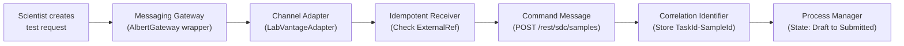
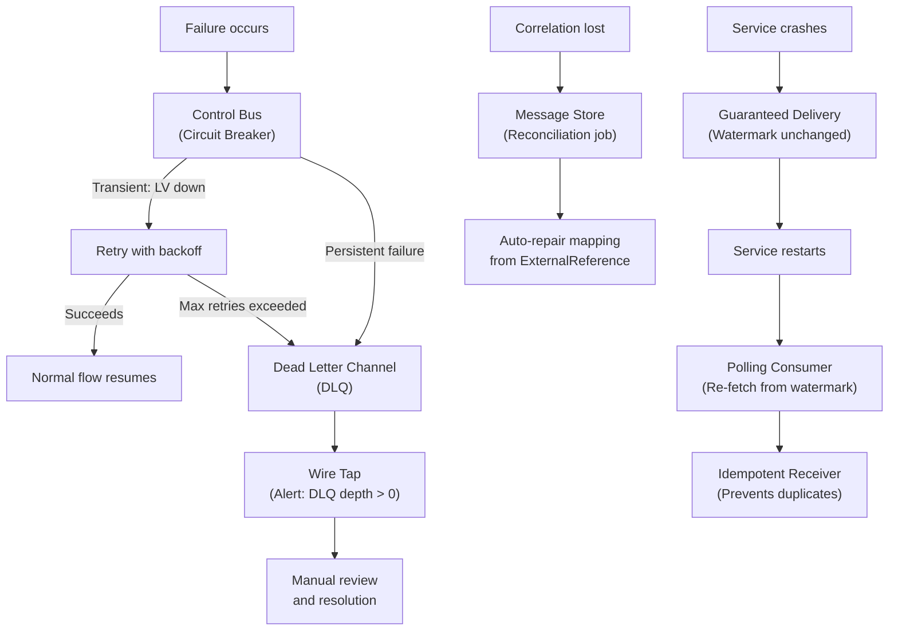

# Pattern and Temporal Tutorial for the AlbertHub Case Study

**Purpose:** A structured training session for your interview with Jim Smitley on February 17, 2026.
**Reading time:** ~70 minutes (designed for one sitting tonight, Part 5 as a morning refresher)

This document is written as a personalized tutorial. Parts 1 and 2 are framed as if **Gregor Hohpe** (the author of Enterprise Integration Patterns) has reviewed your case study and is walking you through the patterns in your design. Parts 3 and 4 are framed as if a **Temporal architect** is explaining how their workflow engine solves the exact challenges in your LIMS integration. Part 5 brings both perspectives together into conversation-ready answers.

---

## Table of Contents

- [PART 1: Your Integration Patterns, Explained](#part-1-your-integration-patterns-explained)
  - [The Philosophy: Why Messaging Architecture Fits Your Problem](#the-philosophy-why-messaging-architecture-fits-your-problem)
  - [The Endpoints: How Your Systems Connect](#the-endpoints-how-your-systems-connect)
  - [The Messages: What Flows Between Systems](#the-messages-what-flows-between-systems)
  - [The Channels: How Delivery and Failure Work](#the-channels-how-delivery-and-failure-work)
  - [The Transformations: How Data Formats Are Bridged](#the-transformations-how-data-formats-are-bridged)
  - [The Operations: How You Keep It Running](#the-operations-how-you-keep-it-running)
  - [The Orchestration: How the Whole Workflow Holds Together](#the-orchestration-how-the-whole-workflow-holds-together)
- [PART 2: How the Patterns Work Together](#part-2-how-the-patterns-work-together)
  - [The Outbound Flow: Scientist Submits a Test Request](#the-outbound-flow-scientist-submits-a-test-request)
  - [The Inbound Flow: Results Come Back](#the-inbound-flow-results-come-back)
  - [The Error Flow: Something Breaks](#the-error-flow-something-breaks)
- [PART 3: Your Integration with Temporal](#part-3-your-integration-with-temporal)
  - [Why Temporal Fits This Problem](#why-temporal-fits-this-problem)
  - [The Mapping: Your Custom Components to Temporal Primitives](#the-mapping-your-custom-components-to-temporal-primitives)
- [PART 4: The Complete LIMS Workflow in Temporal](#part-4-the-complete-lims-workflow-in-temporal)
  - [Activities: The Real Work](#activities-the-real-work)
  - [The Workflow: Orchestrating the Lifecycle](#the-workflow-orchestrating-the-lifecycle)
  - [What This Gives You](#what-this-gives-you)
- [PART 5: Putting It All Together](#part-5-putting-it-all-together)
  - [Why polling instead of webhooks or real-time streaming?](#why-polling-instead-of-webhooks-or-real-time-streaming)
  - [Walk me through the state machine in detail.](#walk-me-through-the-state-machine-in-detail)
  - [What happens when things break?](#what-happens-when-things-break)
  - [How would you make this resilient by design?](#how-would-you-make-this-resilient-by-design)
  - [Why not use Temporal from day one?](#why-not-use-temporal-from-day-one)
  - [Quick Reference: Pattern Vocabulary Cheat Sheet](#quick-reference-pattern-vocabulary-cheat-sheet)
- [PART 6: Patterns Across All Four Workstreams](#part-6-patterns-across-all-four-workstreams)
  - [Overview: The Four Workstreams](#overview-the-four-workstreams)
  - [Workstream 1: ELN Migration (Biovia ELN → Albert Notebook)](#workstream-1-eln-migration-biovia-eln--albert-notebook)
  - [Workstream 2: LIMS Integration (LabVantage ↔ Albert LIMS)](#workstream-2-lims-integration-labvantage--albert-lims)
  - [Workstream 3: Data Warehouse (Albert → Azure)](#workstream-3-data-warehouse-albert--azure)
  - [Workstream 4: Inventory Migration (CISPro → Albert Inventory)](#workstream-4-inventory-migration-cispro--albert-inventory)
  - [Cross-Workstream Pattern Summary](#cross-workstream-pattern-summary)

---

# PART 1: Your Integration Patterns, Explained

*A walkthrough of the Enterprise Integration Patterns in your AlbertHub LIMS design*

---

## The Philosophy: Why Messaging Architecture Fits Your Problem

Before we look at individual patterns, let's talk about why a messaging-style architecture is the right foundation for your LIMS integration.

When two systems need to exchange data, there are broadly two approaches. The first is to make remote calls look like local function calls: your code calls LabVantage the same way it would call a local method, and the framework handles the network details behind the scenes. This is the Remote Procedure Call (RPC) approach, and it's appealing because it feels familiar.

The problem is that this approach is an **illusion**. It pretends that calling LabVantage is like calling a local function, but the reality is very different. LabVantage might be slow. It might be down. The network might drop mid-call. Your service might crash between sending a request and recording the response. An illusion that hides these realities doesn't protect you from them; it just makes the failures more surprising when they happen.

The alternative is what we call **honest architecture**: an architectural style that acknowledges the real constraints of the environment. Your LIMS integration lives in a world where:

- Lab tests take hours to days. Nothing is "real-time" relative to the business process.
- LabVantage has no way to push notifications to you. You have to go ask for results.
- Either system can be temporarily unavailable.
- Network calls can fail partway through.

A messaging-based design doesn't hide any of this. It embraces it. Your integration service talks to a channel (the poller, the queue), not directly to LabVantage's UI. Messages buffer when the other side is slow. Failures are expected and handled, not surprising. This is the foundation that all 16 patterns in your design build on.

Think of it as the difference between pretending the weather is always sunny (and being surprised by rain) versus carrying an umbrella because you know it rains sometimes. Your architecture carries an umbrella.

---

## The Endpoints: How Your Systems Connect

Endpoints are the patterns that describe how your application connects to the messaging system. In your case, this is how the integration service interfaces with both Albert and LabVantage.

### Polling Consumer

**The problem it solves:** You need to get test results from LabVantage, but LabVantage has no way to tell you when results are ready. There's no webhook, no push notification, no event stream. The only way to find out if something has changed is to go and look.

**How it works in your design:** Your Result Poller runs on a schedule (every 5 minutes). Each cycle, it asks LabVantage: "Have any tests been completed since the last time I checked?" It does this with a GET request to the LabVantage REST API, passing a watermark timestamp. If there are new results, it processes them. If not, it sleeps until the next cycle.

This is the **Polling Consumer** pattern. The consumer (your poller) actively goes to the source and pulls data, rather than waiting for data to be pushed to it.

**Why it fits your situation:** Lab tests take hours to days. A 5-minute polling interval means results appear in Albert within 5 minutes of completion. From the scientist's perspective, that's effectively instant. You don't need sub-second latency for a process that takes 48 hours. The simplicity of polling (no event bus to operate, no webhook infrastructure to build, no delivery guarantees to implement) is worth far more than shaving 4 minutes off the notification time.

**The alternative you didn't choose:** The **Event-Driven Consumer** sits and waits for events to arrive, rather than going out to look for them. You'd use this if LabVantage supported webhooks or an outbound event stream. If Albert's long-term AlbertHub vision includes real-time eventing across all integrations, you might invest in building a webhook receiver or an event bridge. But for this specific integration, polling is simpler, more predictable, and perfectly adequate.

**Connection to other patterns:** The Polling Consumer works hand-in-hand with **Guaranteed Delivery** (the watermark ensures you never miss a result) and the **Process Manager** (the state machine tracks where each request is in the lifecycle).

---

### Idempotent Receiver

**The problem it solves:** In distributed systems, things fail in the middle. Your integration service might successfully create a sample in LabVantage, then crash before it records that fact. When it restarts and retries, it would create a *second* sample for the same request. Now you have duplicate lab work, wasted reagents, confused scientists, and corrupted data. In a laboratory setting, this isn't just an inconvenience; it's a data integrity violation.

**How it works in your design:** Before creating a sample in LabVantage, the integration service first checks: "Does a sample already exist in LabVantage with an ExternalReference matching this Albert TaskId?" If yes, the sample was already created (probably in a previous attempt that didn't complete cleanly), so skip the creation step and proceed with the existing SampleId. This check makes the creation operation **idempotent**, meaning you can safely retry it as many times as you need without creating duplicates.

The concrete implementation: `GET /rest/sdc/samples?queryid=FindByExternalRef&param1={albert_task_id}`. If the query returns a result, the sample exists. If it returns nothing, proceed with the POST.

**Why it fits your situation:** The LabVantage API requires two separate calls to create a sample and then add a test to it. This is a non-atomic operation, which means there's a real window where the first call succeeds but the second fails (or the correlation isn't saved). The Idempotent Receiver pattern is your safety net for exactly this scenario.

**The alternative you didn't choose:** You could rely on a transaction log or outbox pattern where you write the intent to a local database first and then process it. This is valid but adds another moving part. The ExternalReference-based check is simpler because it uses data that's already in LabVantage, requiring no additional infrastructure.

**Connection to other patterns:** The Idempotent Receiver is your first line of defense against duplicate data. The **Dead Letter Channel** is your second line (for cases where idempotency can't resolve the problem). The **Correlation Identifier** (ExternalReference field) is the mechanism that makes the idempotency check possible.

---

### Channel Adapter

**The problem it solves:** LabVantage speaks one language (its REST API with proprietary query IDs, RESTPolicy security, and SDC resource paths). Albert speaks another (the Albert SDK with its own task model). You need something in between that translates one system's native interface into a common format your integration service can work with.

**How it works in your design:** The `LIMSConnector` interface is your Channel Adapter. It defines a standard set of operations: `authenticate()`, `submit_request()`, `poll_results()`, `map_inbound()`, `map_outbound()`. The `LabVantageAdapter` is the concrete implementation that knows how to talk to LabVantage's specific API.

When the framework calls `submit_request(task)`, the LabVantageAdapter translates that into `POST /rest/sdc/samples` with the right field mappings. The framework doesn't need to know anything about LabVantage's API details. It just calls the adapter.

**Why it fits your situation:** This is the architectural decision that makes the connector framework scalable. Today you have one adapter (LabVantage). Tomorrow, when a customer needs STARLIMS or LabWare, you build a new adapter that implements the same interface. The framework, the monitoring, the retry logic, the DLQ, everything else stays the same.

**The alternative you didn't choose:** You could build the LabVantage integration as a tightly coupled, one-off script that calls the LabVantage API directly. This would be faster for Customer 1 but would mean starting from scratch for Customer 2. The adapter pattern costs a little more upfront but pays for itself with every subsequent integration.

**Connection to other patterns:** The Channel Adapter is where the **Message Translator** (field mapping) and **Normalizer** (YAML configs) do their work. It's also the boundary that the **Contract Test Harness** validates.

---

### Messaging Gateway

**The problem it solves:** On the Albert side, your integration service needs to create tasks, update statuses, and attach results. The Albert SDK provides these operations, but you don't want your integration logic to be tightly coupled to the specific SDK version or API signatures. You want a clean boundary between "what the integration does" and "how it talks to Albert."

**How it works in your design:** You create a thin wrapper around the Albert SDK called something like `AlbertGateway`. This wrapper is YOUR Messaging Gateway. Your integration code calls methods on this gateway (`gateway.update_task_with_results(task_id, results)`) instead of calling the Albert SDK directly. The gateway implementation uses the Albert SDK internally, but your business logic never touches it directly.

```python
# Your Messaging Gateway (your code)
class AlbertGateway:
    def __init__(self, client: Albert):
        self._client = client
    
    def update_task_with_results(self, task_id: str, results: dict):
        # Your integration calls this clean interface
        # Implementation uses Albert SDK internally
        return self._client.lims.tasks.update(task_id, results=results)

# Integration logic calls YOUR gateway, not the SDK
gateway = AlbertGateway(albert_client)
gateway.update_task_with_results("TASK-123", results)
```

**Why it fits your situation:** Albert is a startup. The SDK will evolve. If the SDK changes its method signature from `tasks.update()` to `tasks.update_results()` or changes the parameter structure, you fix it once in your gateway wrapper, not in every place your integration code needs to update tasks. The gateway isolates you from external changes.

**Connection to other patterns:** The Messaging Gateway on the Albert side mirrors the Channel Adapter on the LabVantage side. Together, they create a clean sandwich: Your AlbertGateway → Integration Logic → Your LabVantageAdapter. Your business logic lives in the middle, decoupled from both external systems through adapters you control.

---

## The Messages: What Flows Between Systems

Messages are the data packages that move between your systems. In your LIMS integration, two types of messages flow, and they have fundamentally different purposes.

### Command Message vs. Document Message

**The problem they solve:** When the scientist submits a test request, the integration service needs to *tell* LabVantage to do something (create a sample, run a test). When LabVantage completes the test, it needs to *inform* Albert of the results. These are two different kinds of communication. One is an instruction. The other is information.

**How they work in your design:**

The outbound message (Albert to LabVantage) is a **Command Message**. It says: "Create this sample with these attributes and run this test using this template." It's an instruction that triggers action on the receiving end. The data in the message serves the command: sample type, test template ID, priority, due date.

The inbound message (LabVantage to Albert) is a **Document Message**. It says: "Here are the completed results for this test: measured value 52, unit SPF, analyst Jane Smith, completion date February 15." It carries data for the receiver to consume however it sees fit. Albert might display it, store it, trigger a notification, or feed it to an AI model. The sender doesn't dictate what happens with the data.

**Why this distinction matters:** It affects error handling. If a Command Message fails, you need to retry it (the action needs to happen). If a Document Message fails, you need to re-fetch it (the data needs to arrive). Your outbound retry logic is "try sending the command again." Your inbound retry logic is "try fetching the results again." Same concept (retry), different mechanics, because the messages have different purposes.

### Correlation Identifier

**The problem it solves:** When you submit a test request from Albert to LabVantage, you get back a LabVantage SampleId. Later, when results come back, they reference the SampleId. But Albert knows nothing about SampleIds. Albert knows TaskIds. You need a way to link these two identifiers so you can route results back to the right task.

**How it works in your design:** When the integration service creates a sample in LabVantage, it stores the Albert TaskId in LabVantage's ExternalReference field. This means every sample in LabVantage carries a pointer back to the Albert task that created it. The integration service also maintains a correlation table: `task_id ↔ sample_id ↔ test_id`.

When the poller retrieves a completed result, it reads the ExternalReference from the LabVantage response, looks up the corresponding TaskId, and pushes the result to the right Albert task. The ExternalReference is the Correlation Identifier: the thread that ties the entire conversation together.

**Why it fits your situation:** This is not optional. Without a Correlation Identifier, you have no way to connect results back to requests. The ExternalReference field is ideal because it's stored in LabVantage itself, meaning even if your correlation table is lost or corrupted, the reconciliation job can rebuild it by querying LabVantage for all samples with ExternalReference values that match the Albert TaskId pattern.

**Connection to other patterns:** The Correlation Identifier is the foundation that makes the **Idempotent Receiver** (check ExternalReference before creating), the **Message Store** (correlation table), and the **Process Manager** (state tracking per request) possible.

---

## The Channels: How Delivery and Failure Work

Channels are the plumbing. They're not glamorous, but they determine whether your integration is reliable or fragile.

### Dead Letter Channel

**The problem it solves:** Sometimes a message just can't be processed. The LabVantage API returns an error that retrying won't fix. A result doesn't match any known correlation. The data is malformed in a way no automated handler can resolve. What do you do with these messages? You can't just drop them. In a lab setting, a silently dropped result could mean a scientist never learns their test completed.

**How it works in your design:** Messages that fail after exhausting all retry attempts are routed to the Dead Letter Queue (DLQ). The DLQ is a holding area where failed messages wait for human review. Each entry includes the original message, the error details, the number of retry attempts, and timestamps. An operator can examine the failure, fix the underlying issue, and either replay the message or resolve it manually.

**Why it fits your situation:** The DLQ is your safety net of last resort. It guarantees that nothing is silently lost. Combined with an alert (DLQ depth > 0 triggers a notification), it ensures that failures are visible and actionable.

**The alternative you didn't choose:** You could log errors and move on, expecting someone to review log files. But logs are noisy, and failed messages get buried. The DLQ makes failures first-class citizens: they're stored, counted, alerted on, and individually resolvable.

### Guaranteed Delivery

**The problem it solves:** What happens if your integration service goes down for 2 hours while lab tests are completing in LabVantage? When the service comes back up, how does it know which results it missed? If the service only processes results "as they arrive," then anything that completed during the outage is silently lost.

**How it works in your design:** The watermark. Your poller maintains a persistent timestamp representing "the last result I successfully processed." Every poll cycle asks: "Give me everything completed since this timestamp." If the service goes down for 2 hours and 50 results complete during that time, the first poll after recovery retrieves all 50. Nothing is missed because the watermark didn't advance while the service was down.

The watermark only advances after results are successfully pushed to Albert. If the service crashes after fetching results but before pushing them, it will re-fetch and re-process them on restart. The Idempotent Receiver prevents duplicates.

**Why it fits your situation:** Labs can't afford to lose results. A scientist waiting for an SPF test result shouldn't have to wonder whether the integration dropped it. The watermark guarantee is simple and robust: if the result exists in LabVantage, the poller will eventually find it and deliver it to Albert.

---

## The Transformations: How Data Formats Are Bridged

LabVantage and Albert don't speak the same data language. The transformation patterns handle the translation.

### Message Translator

**The problem it solves:** LabVantage has its own field names, data formats, and conventions. Albert has different ones. When you submit a request to LabVantage, you need to translate Albert's field names into LabVantage's. When results come back, you need to translate LabVantage's field names into Albert's. This translation needs to happen reliably and consistently.

**How it works in your design:** The `map_outbound()` method translates an Albert task into a LabVantage sample creation request. The `map_inbound()` method translates a LabVantage test result into an Albert task update. These are the Message Translators: they sit between the systems and convert data formats.

For example, `map_outbound()` might take `albert_task.test_type = "SPF"` and translate it to `labvantage_request.testtemplateid = "TPL_SPF_FDA"`. The mapping logic lives in the adapter, driven by the YAML configuration.

### Canonical Data Model

**The problem it solves:** Imagine Albert integrates with LabVantage, then STARLIMS, then LabWare. Without a shared internal format, you'd need translators between every pair of systems: Albert-to-LabVantage, Albert-to-STARLIMS, Albert-to-LabWare. That's 3 translators for 3 systems. Add a fourth system and you need a fourth translator. The complexity grows linearly with each new system.

But what if two LIMS systems need to exchange data through Albert? Now you'd need LabVantage-to-STARLIMS translators too. The complexity grows quadratically.

**How it works in your design:** AlbertHub's internal format is the Canonical Data Model. Every LIMS adapter translates external data into this single common format. A LabVantage result becomes an AlbertHub result. A STARLIMS result becomes an AlbertHub result. They look the same once they're inside the system.

This means adding a new LIMS system requires exactly one new adapter, regardless of how many other systems are already connected. You never build N-to-N translators. You build N-to-1 and 1-to-N. This is the core of why the connector framework scales.

### Normalizer

**The problem it solves:** Different LabVantage customers might use different field names for the same concept. One customer calls the test result field `measured_value`. Another calls it `result_data`. Another calls it `final_result`. You need a way to handle this variation without writing custom code for each customer.

**How it works in your design:** The YAML field mapping configuration. Each customer's connector config includes a `field_mapping` section that maps their specific field names to the canonical model. The Normalizer reads this configuration and applies the mapping at runtime. New customer, new config file, no code changes.

```yaml
field_mapping:
  inbound:
    result_value: measured_value    # Customer A calls it "measured_value"
    result_unit: unit
    analyst: completed_by
```

A different customer's config might say:

```yaml
field_mapping:
  inbound:
    result_value: final_result     # Customer B calls it "final_result"
    result_unit: uom
    analyst: analyst_name
```

Same integration framework, same adapter, different config.

---

## The Operations: How You Keep It Running

These patterns address what happens after the integration is deployed. Production systems need monitoring, persistence, and operational control.

### Wire Tap

**The problem it solves:** You need to observe what's flowing through the integration without disrupting it. How many requests are being submitted? How many results are being retrieved? How fast is the polling cycle? Is the DLQ growing? You need visibility into the system's behavior without adding overhead or changing the message flow.

**How it works in your design:** Your monitoring dashboard is a Wire Tap. It passively observes the messages flowing through the system and records metrics: request volume, success rate, DLQ depth, poll latency, error rate. The integration service instruments these metrics as messages flow through, and the dashboard displays them.

Think of it as a transparent wiretap on a phone line: you can listen to the conversation without the participants knowing or being affected.

### Message Store

**The problem it solves:** You need to keep a persistent record of which Albert tasks map to which LabVantage samples. This mapping is critical for routing results back to the right tasks, for the reconciliation job, and for debugging when something goes wrong.

**How it works in your design:** The correlation table in your database is a Message Store. It persists the `TaskId ↔ SampleId ↔ TestId` mappings so they survive service restarts, deployments, and failures. The reconciliation job queries this store hourly to verify that all mappings are consistent with what's in LabVantage.

### Control Bus

**The problem it solves:** You need to manage the integration service itself, not just the messages flowing through it. Is the service healthy? What state is the circuit breaker in? Should we pause polling during a LabVantage maintenance window?

**How it works in your design:** Your health check endpoint (`/health`) and circuit breaker state management are your Control Bus. The health check reports whether the service is running, when the last successful poll was, and whether the DLQ depth is within thresholds. The circuit breaker tracks consecutive failures to LabVantage and automatically pauses outbound requests when LabVantage appears to be down, resuming automatically when connectivity returns.

---

## The Orchestration: How the Whole Workflow Holds Together

These are the patterns that coordinate the overall flow of the integration.

### Process Manager

**The problem it solves:** A test request in your integration has a lifecycle: it's created as a draft, submitted to LabVantage, enters testing, completes, gets approved, and the results are delivered to Albert. At each stage, different actions need to happen. Different failure modes apply. Different participants are involved. You need something that tracks where each request is in this lifecycle and coordinates the appropriate actions at each stage.

**How it works in your design:** The state machine in your case study is a Process Manager. It maintains the current state of each test request (Draft, Submitted, InProgress, Completed, Approved, Failed, OnHold, Rejected, Cancelled) and triggers the right actions at each transition.

When the poller detects that a LabVantage test has moved from "In Progress" to "Completed," the Process Manager triggers: fetch the result data, validate the correlation, push results to Albert, update the state to "Results Received," notify the scientist.

If you look at the routing patterns decision tree (from the YOW! 2017 talk), the Process Manager is the "Any Path" pattern. It handles composed, sequential, stateful message processing where the path isn't predetermined. That describes your LIMS integration exactly: a request might complete smoothly, or it might be put on hold, rejected, re-tested, or cancelled. The Process Manager handles all of these paths.

**Why this is the most important pattern in your design:** Every other pattern handles one specific concern (polling, idempotency, transformation, monitoring). The Process Manager ties them all together into a coherent workflow. It's the conductor of the orchestra. Without it, you have a collection of independent components. With it, you have an integration.

**The alternative you didn't choose:** A simpler approach would be stateless processing: each poll cycle processes whatever it finds, with no memory of what came before. This works for simple one-shot integrations but breaks down when you need to track lifecycle states, handle partial failures, or coordinate multi-step operations.

**Connection to Temporal:** The Process Manager is the pattern that Temporal replaces most directly. Temporal's workflow is essentially a Process Manager as a service, with built-in state persistence, crash recovery, and execution history. We'll explore this in detail in Part 3.

### Content-Based Router

**The problem it solves:** In the future, when AlbertHub supports multiple LIMS systems, incoming requests need to be directed to the right adapter. A request for a LabVantage customer goes to the LabVantageAdapter. A request for a STARLIMS customer goes to the STARLIMSAdapter. The routing decision is based on the content of the request (specifically, the connector configuration for that customer).

**How it works in your design:** This is part of the future AlbertHub vision. Today, with one LIMS adapter, there's no routing decision to make. But the connector framework architecture is designed so that when the second LIMS platform is added, the Content-Based Router reads the customer's connector config and directs the request to the appropriate adapter.

---

# PART 2: How the Patterns Work Together

*Patterns gain their real power from how they combine, not from individual definitions.*

The patterns above are not independent tools you pull off a shelf. They form a connected design where each pattern enables the next one. Here's how they work together across the three main flows of your integration.

---

## The Outbound Flow: Scientist Submits a Test Request



Here's the story: A scientist creates a test request in Albert. The **Messaging Gateway** (your `AlbertGateway` wrapper around the SDK) notifies the integration service. The **Channel Adapter** (LabVantageAdapter) prepares the request using the **Message Translator** to convert Albert's format into LabVantage's format. Before creating anything, the **Idempotent Receiver** checks whether this request has already been submitted. If not, it sends a **Command Message** (POST to create the sample). The **Correlation Identifier** (ExternalReference) is stored, linking the Albert TaskId to the new LabVantage SampleId. The **Process Manager** updates the state from "Draft" to "Submitted."

**The critical handoff:** The Idempotent Receiver is what makes this flow safe to retry. If anything fails after the sample is created in LabVantage, the retry will detect the existing sample and skip re-creation. This is the difference between a fragile integration that creates duplicates on failure and a robust one that handles failures gracefully.

---

## The Inbound Flow: Results Come Back

```mermaid
flowchart LR
    Timer["Polling Consumer\n(Every 5 min)"] --> Query["GET results since\nwatermark timestamp"]
    Query --> Translate["Message Translator\n(map_inbound)"]
    Translate --> Normalize["Normalizer\n(YAML field mapping)"]
    Normalize --> Verify["Correlation Identifier\n(SampleId to TaskId)"]
    Verify --> Push["Messaging Gateway\n(AlbertGateway update)"]
    Push --> Advance["Guaranteed Delivery\n(Advance watermark)"]
    Advance --> State["Process Manager\n(State: Completed)"]
```



Here's the story: The **Polling Consumer** wakes up every 5 minutes and queries LabVantage for results completed since the watermark. For each result, the **Message Translator** and **Normalizer** convert LabVantage's field names into AlbertHub's canonical format using the YAML configuration. The **Correlation Identifier** maps the SampleId back to the Albert TaskId. The **Messaging Gateway** (your `AlbertGateway` wrapper) pushes the results to the correct task via the SDK. Only after the push succeeds does **Guaranteed Delivery** advance the watermark. The **Process Manager** transitions the state to "Completed" or "Approved."

**The critical handoff:** The watermark only advances after successful delivery. If the service crashes between fetching results and pushing them to Albert, the next poll will re-fetch and re-process those results. Combined with the Idempotent Receiver on the Albert side, this guarantees no results are lost and no duplicates are created.

---

## The Error Flow: Something Breaks



Three types of failures, three different pattern combinations:

**Transient failures (LabVantage temporarily down):** The **Control Bus** (circuit breaker) detects consecutive failures and pauses outbound requests. Retries happen with exponential backoff. If retries are exhausted, the message goes to the **Dead Letter Channel**. The **Wire Tap** (monitoring) alerts the team.

**Crash recovery (integration service goes down):** The **Guaranteed Delivery** watermark didn't advance, so nothing is lost. When the service restarts, the **Polling Consumer** re-fetches from where it left off. The **Idempotent Receiver** prevents duplicates from the re-processing.

**Correlation loss (sample created but mapping not saved):** The **Message Store** (correlation table) is checked hourly by the reconciliation job, which queries LabVantage for samples with ExternalReference values that aren't in the local table. Found an orphan? Auto-repair the mapping.

**The key insight:** No single pattern handles all failures. The patterns work as a layered defense. Idempotency prevents duplicates. The watermark prevents data loss. The DLQ prevents silent failures. The reconciliation job catches edge cases. Together, they make the integration resilient.

---

# PART 3: Your Integration with Temporal

*How Temporal's workflow engine maps to the exact challenges in your case study*

---

## Why Temporal Fits This Problem

Let's look at what your LIMS integration actually does:

1. A scientist submits a request. The integration service creates a sample in LabVantage.
2. The service waits (hours or days) for lab work to complete.
3. Periodically, it polls LabVantage to check if results are ready.
4. When results arrive, it pushes them back to Albert.
5. If anything fails along the way, it retries, recovers, or escalates.

This is a **long-running workflow**. It starts, waits for an extended period, does periodic work during that wait, and eventually completes. Along the way, it needs to survive crashes, handle failures, and track its own state.

Temporal is an open-source workflow engine that was built for exactly this type of problem. It's used at Stripe for payment processing, at Netflix for media encoding pipelines, and at Datadog for infrastructure automation. All of these share the same characteristics as your LIMS integration: long-running, multi-step, failure-prone, and needing reliable completion.

The core concept in Temporal is simple: you write your workflow as ordinary code (if/else, loops, function calls), and Temporal makes that code **durable**. If the service crashes mid-execution, Temporal automatically resumes from where it left off. You don't need to build watermarks, reconciliation jobs, or state machines. Temporal handles all of that as infrastructure.

---

## The Mapping: Your Custom Components to Temporal Primitives

Let's walk through each piece of your current design and see what Temporal offers instead.

### Your State Machine → Temporal Workflow

**What you're building today:** A Process Manager implemented as a state machine. You store the current state of each request in a database (Draft, Submitted, InProgress, Completed, etc.). Your code checks the state before each action and updates it after. If the service crashes, it reads the state from the database on restart and picks up where it left off.

**What Temporal provides:** A Temporal Workflow is essentially a Process Manager as a service. You write the lifecycle as a function:

```python
@workflow.defn
class LIMSRequestWorkflow:
    @workflow.run
    async def run(self, task: AlbertTask) -> str:
        # Step 1: Submit to LabVantage
        sample_id = await workflow.execute_activity(
            submit_to_labvantage,
            task,
            start_to_close_timeout=timedelta(minutes=5),
        )

        # Step 2: Poll until results are ready
        result = None
        while result is None:
            await asyncio.sleep(300)  # 5-minute durable timer
            result = await workflow.execute_activity(
                poll_labvantage_results,
                sample_id,
                start_to_close_timeout=timedelta(minutes=2),
            )

        # Step 3: Push results back to Albert
        await workflow.execute_activity(
            update_albert_task,
            UpdateRequest(task_id=task.task_id, result=result),
            start_to_close_timeout=timedelta(minutes=2),
        )

        return "completed"
```

There's no state table. There's no "read state from database, figure out what to do next" logic. The code itself IS the state machine. Temporal tracks where you are in the execution. If the service crashes after Step 1 but before Step 2, Temporal replays the workflow from the beginning, skips the activities that already completed, and resumes from Step 2.

**What changes:** You stop building and maintaining a custom state machine. You stop writing checkpoint and recovery logic. You stop worrying about "what happens if we crash between step X and step Y."

**What stays the same:** The `submit_to_labvantage` function still calls `POST /rest/sdc/samples`. The `poll_labvantage_results` function still calls `GET /rest/sdc/samples?queryid=CompletedSince`. The connector logic, the field mapping, the adapter interface, the YAML configs: all identical.

---

### Your Polling Loop with Watermark → Durable Timer + Activity

**What you're building today:** A scheduled polling loop that runs every 5 minutes, tracks a watermark timestamp in the database, queries LabVantage for new results, and advances the watermark after successful processing. If the service goes down, the watermark ensures catch-up on restart.

**What Temporal provides:** The `asyncio.sleep(300)` in the workflow above is a **durable timer**. It's not a regular sleep. If the service crashes during the sleep, Temporal remembers that you were 3 minutes into a 5-minute sleep and resumes with 2 minutes remaining. You don't need a separate watermark because Temporal's execution history IS the watermark. It knows exactly which activities completed and which didn't.

**What changes:** You don't need a watermark table. You don't need catch-up logic. You don't need the reconciliation job for watermark drift. The durability is built into the timer.

**What stays the same:** The polling interval (5 minutes), the LabVantage API call, the result processing logic.

---

### Your Retry Logic → Activity RetryPolicy

**What you're building today:** Custom retry logic with exponential backoff. When a LabVantage API call fails, your code catches the error, waits an increasing amount of time, and retries. After N failures, it routes to the DLQ. You also implement a circuit breaker that pauses all outbound requests when LabVantage appears to be down.

**What Temporal provides:** Built-in activity retry policies:

```python
retry_policy = RetryPolicy(
    initial_interval=timedelta(seconds=1),
    backoff_coefficient=2.0,
    maximum_attempts=5,
    non_retryable_error_types=["InvalidRequestError"],
)

sample_id = await workflow.execute_activity(
    submit_to_labvantage,
    task,
    start_to_close_timeout=timedelta(minutes=5),
    retry_policy=retry_policy,
)
```

This says: if `submit_to_labvantage` fails, retry up to 5 times with exponential backoff (1s, 2s, 4s, 8s, 16s). Don't retry if the error is an `InvalidRequestError` (that's a bad request, not a transient failure).

**What changes:** You stop writing retry loops and backoff logic. You configure retry policies declaratively. Temporal handles the timing, the counting, and the decision of when to give up.

**What stays the same:** The distinction between retryable and non-retryable errors. You still need to classify errors correctly. Temporal retries for you, but you still tell it which errors are worth retrying.

---

### Your Dead Letter Queue → Temporal's Failed Workflow Handling

**What you're building today:** A custom DLQ where failed messages land after exhausting retries. An alert fires when DLQ depth > 0. Operators review, fix, and replay.

**What Temporal provides:** When a workflow fails (all retries exhausted), it enters a "Failed" state in Temporal's system. The failure is stored with the complete execution history: every activity that ran, every retry that happened, every error that occurred. An operator can see exactly what happened, fix the underlying issue, and restart the workflow from the point of failure.

Temporal's Web UI shows all failed workflows in a searchable list. Each one includes the full history. This is strictly more useful than a DLQ that stores the original message and an error string, because you can see the entire context of the failure, not just the final error.

**What changes:** You stop building a custom DLQ. You get richer failure context for free.

**What stays the same:** The operational process: someone still needs to review failures and resolve them. Temporal makes the review easier but doesn't eliminate the need for human judgment.

---

### Your Reconciliation Job → Temporal Query API

**What you're building today:** An hourly reconciliation job that queries LabVantage for samples with ExternalReference values that aren't in your correlation table, detecting and repairing orphaned mappings.

**What Temporal provides:** The correlation mapping lives inside the workflow state. Each workflow instance knows its own TaskId and SampleId. You can query any workflow's state using Temporal's Query API or Visibility API to check status, retrieve correlation IDs, or list all workflows in a particular state.

Need to find all orphaned samples? Query Temporal for all workflows in "running" state that have been running longer than expected. Need to rebuild your correlation table? Query all workflows and extract their stored TaskId/SampleId pairs.

**What changes:** The reconciliation job becomes simpler or unnecessary, because the correlation data lives in the workflow state itself, not in a separate table that can drift out of sync.

**What stays the same:** The concept of verifying data consistency. If you're cautious (and you should be in a lab setting), you might still run a periodic check comparing Temporal's workflow state against what's in LabVantage.

---

### Your Correlation ID Tracking → Workflow ID

**What you're building today:** A correlation table mapping Albert TaskId to LabVantage SampleId, plus the ExternalReference field in LabVantage.

**What Temporal provides:** You can use the Albert TaskId as the Temporal Workflow ID. Each workflow instance is uniquely identified by its ID. When you start a new workflow for task TASK-123, the workflow ID is `lims-request-TASK-123`. This is the natural correlation identifier. You can look up any workflow by ID, query its state, and retrieve the SampleId stored in its workflow state.

**What changes:** The correlation table becomes optional (Temporal IS the correlation store). You still want the ExternalReference in LabVantage as a backup.

---

### What Temporal Does NOT Replace

Temporal handles orchestration. It does not handle domain logic. Specifically:

- **Your connector logic** (LabVantageAdapter, LIMSConnector interface) stays the same. Temporal calls your functions; it doesn't write them.
- **Your YAML field mapping configs** stay the same. Temporal doesn't know or care about field names.
- **Your LabVantage API calls** stay the same. Temporal doesn't replace HTTP clients.
- **Your Albert SDK calls** stay the same.
- **Your idempotency checks** are still a good idea, even with Temporal. Temporal guarantees at-least-once execution of activities, which means activities might run more than once. Idempotency ensures this is safe.

The mental model: Temporal replaces the **plumbing** (state management, retry logic, crash recovery, scheduling). Your code provides the **substance** (what to do at each step).

---

# PART 4: The Complete LIMS Workflow in Temporal

*An annotated implementation you can walk through on a whiteboard*

This is the complete LIMS integration reimagined as a Temporal workflow. It covers the happy path, error handling, and long-running behavior. The code is Python (matching the case study's tech stack) with commentary explaining each design choice.

---

## Activities: The Real Work

Activities are the functions that do actual work (API calls, database writes, SDK operations). They can fail, be retried, and have side effects. Each activity here corresponds to a step in your integration.

```python
from temporalio import activity
from dataclasses import dataclass

@dataclass
class AlbertTask:
    task_id: str
    sample_type: str
    test_template: str
    priority: str
    due_date: str

@dataclass
class LabVantageResult:
    sample_id: str
    test_id: str
    measured_value: str
    unit: str
    analyst: str
    completion_date: str

@dataclass
class SubmissionResult:
    sample_id: str
    test_id: str
    already_existed: bool


@activity.defn
async def submit_to_labvantage(task: AlbertTask) -> SubmissionResult:
    """
    Outbound: Create sample + test in LabVantage.
    This is the Channel Adapter + Idempotent Receiver + Command Message
    all working together in one activity.
    """
    adapter = LabVantageAdapter(config=load_connector_config())

    # Idempotent Receiver: check if sample already exists
    existing = adapter.find_sample_by_external_ref(task.task_id)
    if existing:
        return SubmissionResult(
            sample_id=existing.sample_id,
            test_id=existing.test_id,
            already_existed=True,
        )

    # Command Message: create the sample
    sample_id = adapter.create_sample(
        external_reference=task.task_id,
        sample_type=task.sample_type,
    )

    # Command Message: add the test
    test_id = adapter.create_test(
        sample_id=sample_id,
        template=task.test_template,
        priority=task.priority,
        due_date=task.due_date,
    )

    return SubmissionResult(
        sample_id=sample_id,
        test_id=test_id,
        already_existed=False,
    )


@activity.defn
async def poll_labvantage_results(sample_id: str) -> LabVantageResult | None:
    """
    Inbound: Check if results are ready for this sample.
    Returns None if not yet complete, or the result data if ready.
    This is the Polling Consumer + Message Translator.
    """
    adapter = LabVantageAdapter(config=load_connector_config())

    test_status = adapter.get_test_status(sample_id)
    if test_status not in ("Completed", "Approved"):
        return None  # Not ready yet, will poll again

    # Message Translator + Normalizer: convert to Albert's format
    raw_result = adapter.get_test_results(sample_id)
    return adapter.map_inbound(raw_result)


@activity.defn
async def update_albert_task(task_id: str, result: LabVantageResult) -> None:
    """
    Push results back to Albert via the SDK.
    This is the Messaging Gateway + Document Message.
    """
    import albert

    albert.lims.tasks.update(
        task_id=task_id,
        status="Results Received",
        result_value=result.measured_value,
        result_unit=result.unit,
        analyst=result.analyst,
        completion_date=result.completion_date,
    )


@activity.defn
async def update_albert_status(task_id: str, status: str) -> None:
    """Update Albert task status without result data (for state transitions)."""
    import albert
    albert.lims.tasks.update(task_id=task_id, status=status)
```

Notice that the activities are just your existing integration logic. The LabVantageAdapter, the Albert SDK calls, the field mapping: all identical to what you'd build without Temporal. Temporal doesn't change what you do; it changes how the steps are coordinated.

---

## The Workflow: Orchestrating the Lifecycle

```python
from temporalio import workflow
from datetime import timedelta
import asyncio

@workflow.defn
class LIMSRequestWorkflow:
    """
    Manages the complete lifecycle of a single LIMS test request.
    This is the Process Manager pattern, implemented as a Temporal workflow.

    Each instance of this workflow handles one Albert Task.
    The Workflow ID is the Albert TaskId, which serves as the
    Correlation Identifier.
    """

    def __init__(self):
        self.cancelled = False
        self.current_status = "Draft"

    @workflow.run
    async def run(self, task: AlbertTask) -> str:

        # --- Step 1: Submit to LabVantage ---
        # Retry policy handles transient failures (LabVantage down, timeouts).
        # Non-retryable errors (400 Bad Request) fail immediately.
        submission = await workflow.execute_activity(
            submit_to_labvantage,
            task,
            start_to_close_timeout=timedelta(minutes=5),
            retry_policy=RetryPolicy(
                initial_interval=timedelta(seconds=2),
                backoff_coefficient=2.0,
                maximum_attempts=5,
                non_retryable_error_types=["InvalidRequestError"],
            ),
        )

        self.current_status = "Submitted"
        await workflow.execute_activity(
            update_albert_status,
            args=[task.task_id, "Submitted to LabVantage"],
            start_to_close_timeout=timedelta(minutes=1),
        )

        # --- Step 2: Poll for results ---
        # This loop runs for as long as the test takes (hours, days, weeks).
        # The sleep is a durable timer: survives crashes and restarts.
        result = None
        poll_count = 0
        max_polls = 2016  # 7 days at 5-min intervals (safety limit)

        while result is None and poll_count < max_polls and not self.cancelled:
            # Durable timer: if the service crashes during this sleep,
            # Temporal resumes with the remaining time when it restarts.
            await asyncio.sleep(300)  # 5 minutes
            poll_count += 1

            result = await workflow.execute_activity(
                poll_labvantage_results,
                submission.sample_id,
                start_to_close_timeout=timedelta(minutes=2),
                retry_policy=RetryPolicy(
                    initial_interval=timedelta(seconds=5),
                    backoff_coefficient=2.0,
                    maximum_attempts=3,
                ),
            )

            # Update status if test is now in progress
            if result is None and poll_count == 1:
                self.current_status = "InProgress"

        # Handle cancellation
        if self.cancelled:
            self.current_status = "Cancelled"
            await workflow.execute_activity(
                update_albert_status,
                args=[task.task_id, "Cancelled"],
                start_to_close_timeout=timedelta(minutes=1),
            )
            return "cancelled"

        # Handle timeout (no results after max polls)
        if result is None:
            self.current_status = "TimedOut"
            await workflow.execute_activity(
                update_albert_status,
                args=[task.task_id, "Timed Out - Manual Review Required"],
                start_to_close_timeout=timedelta(minutes=1),
            )
            return "timed_out"

        # --- Step 3: Push results to Albert ---
        self.current_status = "Completed"
        await workflow.execute_activity(
            update_albert_task,
            args=[task.task_id, result],
            start_to_close_timeout=timedelta(minutes=2),
            retry_policy=RetryPolicy(
                initial_interval=timedelta(seconds=1),
                backoff_coefficient=2.0,
                maximum_attempts=5,
            ),
        )

        return "completed"

    @workflow.signal
    async def cancel_request(self):
        """Signal handler: scientist cancels the test request in Albert."""
        self.cancelled = True

    @workflow.query
    def get_status(self) -> str:
        """Query handler: check current status of this request."""
        return self.current_status
```

---

## What This Gives You

Read the code above and compare it to the architecture in your presentation:

| Presentation Component | Where It Lives in the Temporal Workflow |
|---|---|
| Request Handler (outbound) | `submit_to_labvantage` activity |
| Result Poller (inbound) | `poll_labvantage_results` activity called in a loop |
| State Manager (correlation IDs) | Workflow ID = TaskId; SampleId stored in workflow state |
| Error Handler (circuit breaker, retry) | `RetryPolicy` on each activity |
| Dead Letter Queue | Temporal's failed workflow state (with full execution history) |
| Monitoring + Alerts | Temporal Web UI + Temporal metrics (Prometheus-compatible) |
| State Machine (Draft → Submitted → InProgress → Completed) | The `run()` method IS the state machine. Control flow = state transitions. |

The workflow code is about 80 lines. The equivalent custom implementation (state machine, retry logic, watermark tracking, crash recovery, DLQ routing, reconciliation) would be several hundred lines plus a database schema.

**The signal handler** (`cancel_request`) demonstrates something that's particularly elegant with Temporal. In the custom implementation, handling a cancellation mid-workflow requires: checking a cancellation flag in the database before each poll, updating the state, and cleaning up. With Temporal, you define a signal handler and set a flag. The while loop checks the flag on each iteration. That's it.

**The query handler** (`get_status`) lets external code ask "what's the status of this request?" without hitting a database. Temporal serves the answer from the workflow's in-memory state.

---

# PART 5: Putting It All Together

*How to talk about patterns and Temporal in conversation with Jim*

---

## "Why polling instead of webhooks or real-time streaming?"

**What "event streaming" or webhooks means here:** In some integrations, the external system *pushes* when something happens instead of us asking. Two common mechanisms:

- **Webhook:** They call an HTTP endpoint we expose. When "sample completed" happens, LabVantage (or their middleware) sends a POST to our URL with the event payload. One request per event; we don't hold a long-lived connection.

- **Subscribe to a stream of events:** Here we don't wait for them to POST to us; we establish a *subscription* to a channel of events. Technically that usually means one of: (1) **Message broker** — LabVantage (or an adapter) publishes messages to a topic (e.g. Kafka, RabbitMQ); our service subscribes to that topic and consumes messages. We run a consumer loop that reads from the broker. (2) **Long-lived connection** — We open a connection to their system (e.g. Server-Sent Events or WebSocket) and they push events over that connection as they occur. (3) **Streaming or long-poll API** — We call an API that blocks until events are available (or a timeout), then returns a batch; we call again to get more. In all cases we receive a *sequence* of events (e.g. "sample completed", "result approved") instead of us repeatedly asking "what's new?" via a normal REST call. Our service would then look up the Albert TaskId from the LabVantage SampleId (correlation) and call the Albert gateway to update the task. Bridge: LabVantage → our integration service (webhook receiver or event subscriber) → Albert SDK/gateway. We don't have that option because LabVantage doesn't offer outbound webhooks or an event stream; we can only pull via their API.

Here's how to answer this, drawing on both the pattern vocabulary and the honest-architecture philosophy:

"I chose the **Polling Consumer** pattern for this integration. The core reason is that LabVantage has no native webhook or event streaming capability, so we can't receive push notifications even if we wanted to. But even if LabVantage did support webhooks, I'd still lean toward polling for this use case.

Lab tests take hours to days. A 5-minute polling interval means results appear in Albert within 5 minutes of completion. From the scientist's perspective, that's effectively instant. The business process doesn't benefit from sub-second latency.

Polling gives us better flow control. We decide when to ask and how much to process at a time. With webhooks, the external system controls the pace, and if LabVantage sends a burst of 500 completions at once, we have to absorb that. With polling, we fetch at our own rate.

Gregor Hohpe talks about this as 'honest architecture.' The real world here is asynchronous and inherently batch-oriented. Lab work doesn't happen in milliseconds. An architecture that acknowledges this (polling every 5 minutes) is a better match to reality than one that pretends real-time delivery matters for a process that takes 48 hours.

If Albert's long-term vision includes real-time eventing across all integrations, not just LIMS, then investing in an event bus becomes worthwhile. At that point, I'd also look at Temporal's durable timers as a way to implement the polling without custom scheduling infrastructure."

---

## "Walk me through the state machine in detail."

"The state machine in my design is what Enterprise Integration Patterns calls a **Process Manager**. It's the most important pattern in the integration because it's the one that ties everything else together.

If you look at the routing patterns decision tree from the EIP book, Process Manager is at the bottom right: it handles composed, sequential, stateful message processing where the path isn't predetermined. That describes our LIMS integration exactly. A request might complete smoothly (Draft → Submitted → InProgress → Completed → Approved), or it might be put on hold, rejected, re-tested, or cancelled. The Process Manager handles all of these paths.

The states map to both systems:

- **Draft**: The scientist created the request in Albert. LabVantage doesn't know about it yet.
- **Submitted**: The integration service successfully created the sample and test in LabVantage. The Correlation Identifier (ExternalReference) links them.
- **InProgress**: The poller detected that an analyst in LabVantage has picked up the test.
- **Completed**: Results are entered. The poller retrieves them and pushes them to Albert.
- **Approved**: A supervisor signed off. The scientist sees final results.

The error states (Failed, OnHold, Rejected, Cancelled) are just as important. OnHold means testing was paused, maybe the instrument is being calibrated. Rejected means the supervisor didn't accept the results, so re-testing is needed. These states map to real lab workflows, not just software states.

If we were using Temporal, the Process Manager becomes the workflow function itself. Instead of tracking state in a database table, the state is implicit in where the code is executing. 'Submitted' means we're past the submit_to_labvantage activity. 'Polling' means we're inside the while loop. 'Completed' means we've exited the loop and are about to push results. The code IS the state machine."

---

## "What happens when things break?"

"I designed the error handling as layered defense, using three EIP patterns working together.

**First layer: the Idempotent Receiver.** This prevents the most common failure mode, which is duplicate data on retry. If the integration service crashes after creating a sample in LabVantage but before recording the correlation, the retry checks LabVantage first using the ExternalReference field. If the sample already exists, skip creation and proceed. This makes the outbound flow safe to retry at any point.

**Second layer: the Dead Letter Channel.** When something fails and retrying won't fix it (bad data, unrecoverable error, mismatch in correlation), the message goes to the DLQ instead of being silently dropped. The Wire Tap (monitoring dashboard) alerts when DLQ depth exceeds zero. In a lab, silently dropping a result is worse than being down, because the scientist might never know their test completed.

**Third layer: Guaranteed Delivery via the watermark.** If the entire integration service goes down for hours, nothing is lost. The watermark timestamp didn't advance while the service was down. On restart, the Polling Consumer re-fetches everything since the last successful checkpoint. Combined with idempotency, the catch-up is automatic and duplicate-safe.

Behind all of this is the **Control Bus** (circuit breaker). When LabVantage is unreachable, the circuit breaker stops sending requests after 3 consecutive failures. This prevents hammering a system that's down and gives it space to recover. When connectivity returns, the circuit breaker closes automatically and normal flow resumes.

With Temporal, the first and second layers still apply because idempotency is important regardless of the orchestration tool. But the third layer (watermark-based crash recovery) becomes unnecessary because Temporal handles crash recovery natively. The workflow resumes from exactly where it left off, including mid-sleep durable timers."

---

## "How would you make this resilient by design?"

"There's a distinction between adding resilience after the fact and building it in from the start. In this design, resilience isn't a layer bolted on top; it's embedded in the pattern choices.

The Polling Consumer is inherently more resilient than a webhook receiver. If the poller misses a cycle, the next cycle catches up. If a webhook is missed, you need retry infrastructure on the sender side, which is infrastructure you don't control.

The Idempotent Receiver makes every operation safe to retry. This means the error handling strategy can always be 'try again,' which is the simplest and most reliable recovery mechanism.

The watermark-based Guaranteed Delivery guarantees no data loss without requiring distributed transactions or complex coordination protocols.

Where this gets really interesting is when you look at **Temporal** as the orchestration layer. Temporal was designed with exactly this philosophy. Every workflow is durable by default. Every activity is retryable by default. Crash recovery is automatic by default. You're not adding resilience to your code; the runtime provides it as a primitive.

The case study currently builds these resilience patterns as custom code (state machine, retry loops, watermark, reconciliation job, DLQ). Temporal gives you the same guarantees but as infrastructure you configure rather than code you maintain. The decision of whether to use Temporal depends on whether the team is ready to adopt it, but either path delivers the same resilience properties."

---

## "Why not use Temporal from day one?"

"Honest answer: if the team is comfortable with Temporal or ready to invest in learning it, I would.

The patterns I'm building custom (state machine, retry logic, crash recovery, watermark tracking) are exactly what Temporal provides as primitives. Every one of those custom components is code I'd have to write, test, debug, and maintain. Temporal is battle-tested infrastructure used at Stripe and Netflix for exactly this type of long-running workflow.

The case for waiting is operational, not architectural. Temporal is another service to deploy and operate. If Albert's engineering team hasn't run Temporal before, the first customer engagement becomes a 'learn Temporal' project on top of a 'build LIMS integration' project. That's two unknowns at the same time, which adds risk.

The case for starting with Temporal is that you avoid building throwaway orchestration code. The migration from custom to Temporal later has its own cost: you need to handle in-flight workflows, re-test everything, and manage the cutover. Starting with Temporal avoids that entirely.

My recommendation is flexible: if the team has Temporal experience or is willing to invest in it, start there. If not, build clean custom orchestration for Customer 1, with the clear intention of adopting Temporal as a near-term evolution. Either way, the connector logic, the adapter interface, and the YAML configs are identical."

---

## Quick Reference: Pattern Vocabulary Cheat Sheet

If you need to drop a pattern name in conversation, here's the quick lookup:

| When You're Talking About... | The Pattern Name Is... | One-Line Description |
|---|---|---|
| The 5-minute polling loop | **Polling Consumer** | Consumer actively checks for new messages on a schedule |
| Checking before creating to avoid duplicates | **Idempotent Receiver** | Processing a message multiple times produces the same result as processing it once |
| The LIMSConnector / LabVantageAdapter | **Channel Adapter** | Connects an application to the messaging system through a standardized interface |
| The AlbertGateway wrapper (around the Albert SDK) | **Messaging Gateway** | Encapsulates messaging-specific code into a clean API |
| Albert TaskId ↔ LabVantage SampleId | **Correlation Identifier** | A unique ID that links related messages across systems |
| "Create this sample" (outbound) | **Command Message** | A message that tells the receiver to perform an action |
| "Here are the results" (inbound) | **Document Message** | A message that carries data for the receiver to process |
| The DLQ for unprocessable messages | **Dead Letter Channel** | A channel for messages that can't be delivered or processed |
| Watermark-based catch-up after downtime | **Guaranteed Delivery** | Ensuring messages are not lost, even if the system fails temporarily |
| map_inbound() / map_outbound() | **Message Translator** | Converts a message from one format to another |
| AlbertHub's internal data format | **Canonical Data Model** | A single shared format that all adapters translate to and from |
| YAML field mapping configs | **Normalizer** | Routes messages through the correct translator to produce a common format |
| The monitoring dashboard | **Wire Tap** | Passively observes messages flowing through without disrupting the flow |
| The correlation table in the database | **Message Store** | Persists message data for later retrieval, reporting, or reconciliation |
| Health checks and circuit breaker | **Control Bus** | A system for managing and monitoring the messaging infrastructure |
| The lifecycle state machine | **Process Manager** | Coordinates a multi-step workflow by maintaining state and routing messages |
| Future multi-LIMS routing | **Content-Based Router** | Routes a message to the correct destination based on its content |

---

# PART 6: Patterns Across All Four Workstreams

*The presentation deep-dives on the LIMS integration, but Jim may ask about any workstream. Here's how the same pattern thinking applies to all four.*

---

## Overview: The Four Workstreams

| # | Workstream | Type | Direction | Deadline |
|---|-----------|------|-----------|----------|
| 1 | ELN Migration (Biovia ELN → Albert Notebook) | One-time file migration | Inbound | **July 1** |
| 2 | LIMS Integration (LabVantage ↔ Albert LIMS) | Ongoing bidirectional | Bidirectional | Desired |
| 3 | Data Warehouse (Albert → Azure) | Ongoing outbound | Outbound | Flexible |
| 4 | Inventory Migration (CISPro → Albert Inventory) | One-time structured data | Inbound | **July 1** |

Each workstream has different characteristics, but many of the same patterns appear in different configurations. The vocabulary you learned for LIMS transfers directly.

---

## Workstream 1: ELN Migration (Biovia ELN → Albert Notebook)

**What it is:** A one-time migration of files and attachments (PDFs, instrument data, images) from Biovia's ELN into Albert's Notebook module. This is NOT structured data. It's files with metadata (project, notebook, experiment, author, dates). The Biovia subscription ends July 1, so everything must be in Albert before that hard cutoff.

**The hard part:** Biovia has no public API for bulk export. You're either using Pipeline Pilot (a Biovia automation tool) or querying the underlying Oracle database directly.

### Patterns That Apply

**Guaranteed Delivery (via staging):** The most important pattern here. You extract all files to a staging area (S3 or Azure Blob) before uploading to Albert. This is the same concept as the watermark in the LIMS integration, but adapted for a bulk migration: the staging area is your "checkpoint." If the upload to Albert fails partway through, you don't need to re-extract from Biovia (which may already be decommissioned). The staging area is your safety net.

**Message Store (manifest):** Every file extracted gets an entry in a manifest CSV with its original path, metadata, SHA-256 checksum, and upload status. This is essentially a Message Store: a persistent record of every "message" (file) that flowed through the system. The manifest is your audit trail and your reconciliation tool. After migration, you can verify: does every entry in the manifest have a corresponding file in Albert?

**Idempotent Receiver (checksum-based):** If a file upload to Albert fails and you retry, how do you avoid uploading the same file twice? The checksum. Before uploading, check if a file with the same checksum already exists in the target Albert project. If yes, skip it. Same pattern as the LIMS ExternalReference check, but using file content hashes instead of TaskIds.

**Channel Adapter (extraction adapter):** Biovia's export mechanism (Pipeline Pilot or Oracle SQL) is specific to Biovia. You'd wrap this in an extraction adapter that presents a clean interface: "give me all files in this project." Whether the implementation uses Pipeline Pilot or raw SQL is hidden behind the adapter. If you later migrate from a different ELN (like PerkinElmer Signals), you build a new extraction adapter with the same interface.

**Wire Tap (progress monitoring):** For a migration of potentially hundreds of thousands of files, you need a progress dashboard: how many files extracted, how many staged, how many uploaded, how many verified. The Wire Tap pattern gives you passive observation of the data flow without slowing it down.

**Dead Letter Channel (failed uploads):** Some files will fail to upload. Maybe the file is corrupted, exceeds Albert's size limit, or uses a format Albert can't process. These failures shouldn't stop the entire migration. Failed files go to a Dead Letter Channel (a separate folder in the staging area, plus an entry in the manifest marked "failed"). After the bulk migration completes, the team reviews the failed files and resolves them individually.

**Process Manager (migration lifecycle):** The overall migration follows a multi-step lifecycle: Extract → Stage → Validate (checksums, counts) → Upload → Verify → Report. Each step depends on the previous one succeeding. The Process Manager coordinates this sequence. If validation fails (counts don't match between Biovia and staging), the migration pauses for investigation rather than blindly proceeding to upload.

**Messaging Gateway (AlbertGateway wrapper):** On the target side, you build a thin wrapper around the Albert SDK that serves as the Messaging Gateway. All file uploads and metadata creation go through this gateway, which delegates to the SDK for authentication, rate limiting, and format requirements. The migration code never calls the Albert SDK or Albert's internal APIs directly; it only talks to the gateway.

### What Temporal Would Look Like

A Temporal workflow for the ELN migration would manage the end-to-end lifecycle:

```python
@workflow.defn
class ELNMigrationWorkflow:
    @workflow.run
    async def run(self, project_id: str) -> MigrationReport:
        # Step 1: Extract files from Biovia to staging
        manifest = await workflow.execute_activity(
            extract_biovia_files,
            project_id,
            start_to_close_timeout=timedelta(hours=4),
        )

        # Step 2: Upload each file to Albert (with progress tracking)
        for file_entry in manifest.files:
            await workflow.execute_activity(
                upload_file_to_albert,
                file_entry,
                retry_policy=RetryPolicy(maximum_attempts=3),
                start_to_close_timeout=timedelta(minutes=10),
            )

        # Step 3: Verify completeness
        report = await workflow.execute_activity(
            verify_migration_completeness,
            args=[project_id, manifest],
            start_to_close_timeout=timedelta(minutes=30),
        )

        return report
```

The key value: if the service crashes after uploading 50,000 of 100,000 files, Temporal resumes from file 50,001. No re-extraction needed.

---

## Workstream 2: LIMS Integration (LabVantage ↔ Albert LIMS)

This is covered extensively in Parts 1 through 5 of this document. It uses the most patterns of any workstream because it's bidirectional, ongoing, and has the most complex failure modes.

**Quick summary of patterns used:** Polling Consumer, Idempotent Receiver, Channel Adapter, Messaging Gateway, Correlation Identifier, Command Message, Document Message, Dead Letter Channel, Guaranteed Delivery, Message Translator, Canonical Data Model, Normalizer, Wire Tap, Message Store, Control Bus, Process Manager, Content-Based Router (future).

---

## Workstream 3: Data Warehouse (Albert → Azure)

**What it is:** An ongoing outbound integration where the customer's Azure Data Factory (ADF) pipeline pulls data from Albert's Data Warehouse API into their Azure Data Lake (ADLS Gen2). Albert provides the API and documentation; the customer builds and operates the ADF pipeline.

**The hard part:** This is actually the simplest workstream from Albert's side. The customer's Azure team knows ADF. The main challenge is providing a stable, well-documented incremental API and handling cross-tenant authentication (multi-tenant Service Principal, because Azure Managed Identities don't work cross-tenant).

### Patterns That Apply

**Polling Consumer (customer-side):** The customer's ADF pipeline is a Polling Consumer. It calls Albert's API on a schedule (hourly or daily), asking: "What has changed since my last extraction?" The watermark is managed by ADF's native incremental extraction pattern (a control table stores the last extraction timestamp). This is the same pattern as your LIMS poller, but the customer operates it.

**Messaging Gateway (Albert's API):** Albert's Data Warehouse API is the Messaging Gateway. It encapsulates all the internal complexity of Albert's data model behind a clean REST interface. The customer doesn't need to know how Albert stores data internally; they just call the API.

**Message Translator (medallion architecture):** The customer transforms Albert's JSON API responses (Bronze layer) into Parquet files (Silver layer) and then into aggregated analytical tables (Gold layer). Each transformation is a Message Translator. The customer owns these translators because the target format depends on their BI tools and analytical needs.

**Guaranteed Delivery (watermark):** Same pattern as LIMS, but operated by the customer. ADF maintains a watermark timestamp. Each extraction asks for data modified since the watermark. If the ADF pipeline goes down for a day, the next run catches up automatically.

**Channel Adapter (Albert's Data Warehouse connector):** Albert's Data Warehouse export capability acts as a Channel Adapter. It translates Albert's internal data structures into a clean API response that external tools can consume. If Albert later needs to support data export through a different mechanism (direct database replication, event streaming, file drops), that would be a new Channel Adapter behind the same interface.

**Canonical Data Model (Albert's export schema):** Albert's API defines a canonical export format. The customer transforms this into whatever their BI tools need (Parquet, Delta Lake, etc.), but the starting point is Albert's standard schema. This means multiple customers pulling from the same API get the same data structure, even if their downstream formats differ.

**Wire Tap (API monitoring):** Albert should monitor its Data Warehouse API: request volume, latency, error rates, and which endpoints are being called most frequently. This is the Wire Tap pattern applied to the API layer. It helps identify if a customer's pipeline is misbehaving (hammering the API, requesting too much data) without interfering with other customers.

**Dead Letter Channel (failed extractions):** If a customer's ADF pipeline fails mid-extraction (network timeout, authentication expiry, schema mismatch), the failed extraction attempt should be logged on Albert's side. This gives Albert visibility into customer-side failures that might lead to support tickets. Even though the customer operates the pipeline, Albert benefits from knowing when things go wrong.

**Control Bus (API rate limiting and health):** Albert's API needs rate limiting to protect the platform from runaway customer pipelines. The Control Bus manages this: tracking request rates per customer, enforcing limits, and providing a health endpoint the customer's ADF can check before starting an extraction.

### What Temporal Would Look Like

For the recommended customer-pull model, ADF has its own orchestration built in, so Temporal isn't needed on the customer side. But there are two scenarios where Temporal would be valuable on Albert's side:

**Scenario 1: Managed Data Export Service.** If Albert evolves toward offering a managed export (Albert pushes data to the customer's storage rather than the customer pulling), Temporal would orchestrate the lifecycle:

```python
@workflow.defn
class DataExportWorkflow:
    @workflow.run
    async def run(self, config: ExportConfig) -> ExportReport:
        # Step 1: Generate export snapshot from Albert DW
        snapshot = await workflow.execute_activity(
            generate_export_snapshot,
            config,
            start_to_close_timeout=timedelta(minutes=30),
        )

        # Step 2: Stage in customer's blob storage
        await workflow.execute_activity(
            upload_to_customer_storage,
            args=[config.customer_id, snapshot],
            retry_policy=RetryPolicy(maximum_attempts=3),
            start_to_close_timeout=timedelta(minutes=15),
        )

        # Step 3: Notify customer that export is ready
        await workflow.execute_activity(
            notify_customer,
            args=[config.customer_id, snapshot.manifest_url],
            start_to_close_timeout=timedelta(minutes=1),
        )

        return ExportReport(success=True, records=snapshot.record_count)
```

**Scenario 2: Schema Change Management.** When Albert's API schema evolves (new fields, renamed fields, deprecated endpoints), existing customer pipelines may break. A Temporal workflow could coordinate the rollout: notify affected customers → wait for acknowledgment → deploy the schema change → monitor for failures → auto-rollback if error rates spike. The durable waiting (customers might take days to acknowledge) is a natural fit for Temporal's signal-based approach.

**Scenario 3: Multi-Customer Export Orchestration.** As Albert scales to dozens of Azure customers, each pulling at different frequencies, a Temporal workflow per customer could manage: check if customer's credentials are still valid → pre-compute the export if needed → serve from cache → track freshness guarantees. This turns ad-hoc customer pulls into a managed, observable service.

---

## Workstream 4: Inventory Migration (CISPro → Albert Inventory)

**What it is:** A one-time migration of structured data from Biovia CISPro (a chemical inventory system) into Albert's Inventory module. The data has complex relational structure: Substances, Lots, Containers, Locations, Pricing, Attributes. These entities reference each other (a Container belongs to a Lot, which belongs to a Substance). The order of operations matters.

**The hard part:** Two things. First, CISPro has no public API, so extraction is via Pipeline Pilot or direct Oracle SQL, same as the ELN. Second, and more importantly, **data quality**. Legacy chemical inventory systems accumulate decades of orphaned records, duplicate substances, inconsistent naming, and broken references. Discovering these issues in production is a disaster. Discovering them in staging is manageable.

### Patterns That Apply

**Message Store (staging database):** The staging PostgreSQL database is the most important component. It's a Message Store where all extracted data lands before going to Albert. But it's more than just a holding area. It's where you run automated data quality checks: duplicate substance detection, orphan detection (lots without substances, containers without locations), CAS number validation, and referential integrity verification. The staging database is your quality control checkpoint.

**Guaranteed Delivery (staging as safety net):** Same concept as the ELN staging area. If the load into Albert fails partway through, the staging database persists. You don't need to re-extract from CISPro. The staging DB is your recovery point. This is critical because CISPro will be decommissioned on July 1.

**Idempotent Receiver (entity-level deduplication):** When loading substances into Albert, you need to handle duplicates. Two CISPro records might represent the same substance (same CAS number, different names). The migration needs to detect and resolve these before loading. This is idempotency at the data level rather than the message level: "does this substance already exist in the target system?"

**Message Translator (entity mapping):** CISPro's data model doesn't match Albert's. Substances in CISPro might have different field names, different categorization schemes, and different attribute structures than Albert's Inventory module expects. The Message Translator handles this conversion, driven by a mapping specification created during discovery.

**Normalizer (custom fields):** Different CISPro installations might have different custom fields. One customer might have a "Purity" custom attribute; another might call it "Grade." The Normalizer (via configuration, not custom code) maps these customer-specific field names to Albert's canonical model.

**Process Manager (load orchestration):** The load into Albert must respect referential integrity. You can't create a Container without first creating the Lot it belongs to, and you can't create a Lot without first creating the Substance. The load sequence (Locations → Substances → Lots → Containers → Pricing → Attributes) is a Process Manager: it coordinates a multi-step operation where each step depends on the previous one completing successfully.

**Dead Letter Channel (failed entity loads):** Some entities will fail to load. A Substance with an invalid CAS number that slipped through quality checks, a Container referencing a Location that was excluded from the migration, or a record that exceeds Albert's field length limits. These failures go to a Dead Letter Channel: a "rejected records" table in the staging DB with the entity data, the error message, and the step where it failed. The migration continues with the remaining records. After the bulk load, the team reviews and resolves the rejected records.

**Wire Tap (load progress):** For a migration of potentially tens of thousands of entities with complex relationships, you need to see progress: how many Substances loaded, how many Lots, how many failed, how long each batch took. The Wire Tap provides this visibility, and it's particularly important for estimating whether the migration will complete before the July 1 deadline.

**Control Bus (load orchestration controls):** The load process needs operational controls: pause if error rate exceeds a threshold, resume after investigation, skip a batch, force-retry a specific entity. The Control Bus provides these levers so the migration operator can intervene without stopping the entire process.

### What Temporal Would Look Like

```python
@workflow.defn
class InventoryMigrationWorkflow:
    @workflow.run
    async def run(self, config: MigrationConfig) -> MigrationReport:
        # Step 1: Extract from CISPro to staging DB
        await workflow.execute_activity(
            extract_cispro_data,
            config,
            start_to_close_timeout=timedelta(hours=2),
        )

        # Step 2: Run data quality checks
        quality_report = await workflow.execute_activity(
            run_quality_checks,
            start_to_close_timeout=timedelta(minutes=30),
        )

        # Step 3: Wait for customer approval of the quality report
        # This is a Signal: the customer reviews and approves
        approved = False
        approval_channel = workflow.get_signal_channel("quality-approved")
        await approval_channel.receive()
        approved = True

        # Step 4: Load in referential integrity order
        load_sequence = [
            "locations", "substances", "lots",
            "containers", "pricing", "attributes",
        ]
        for entity_type in load_sequence:
            await workflow.execute_activity(
                load_entity_batch,
                entity_type,
                retry_policy=RetryPolicy(maximum_attempts=3),
                start_to_close_timeout=timedelta(hours=1),
            )

        # Step 5: Verify completeness
        report = await workflow.execute_activity(
            verify_inventory_completeness,
            start_to_close_timeout=timedelta(minutes=30),
        )

        return report
```

The **signal handler** in Step 3 is particularly powerful. The migration workflow pauses (durably, surviving restarts) until the customer approves the data quality report. This might take hours or days. Without Temporal, you'd need a separate system to track "waiting for customer approval" state. With Temporal, it's just `await approval_channel.receive()`.

---

## Cross-Workstream Pattern Summary

| Pattern | WS1: ELN | WS2: LIMS | WS3: Azure | WS4: Inventory |
|---------|----------|-----------|------------|----------------|
| **Polling Consumer** | | Result Poller | Customer's ADF pipeline | |
| **Idempotent Receiver** | Checksum dedup | ExternalRef check | | CAS number dedup |
| **Channel Adapter** | Biovia extractor | LabVantageAdapter | Albert DW connector | CISPro extractor |
| **Messaging Gateway** | AlbertGateway wrapper | AlbertGateway wrapper | Albert DW gateway wrapper | AlbertGateway wrapper |
| **Correlation Identifier** | File manifest entry | TaskId ↔ SampleId | ADF watermark | Staging DB IDs |
| **Command Message** | | Submit test request | | |
| **Document Message** | File + metadata | Test results | API response data | Entity records |
| **Dead Letter Channel** | Failed uploads queue | Failed messages | Failed extraction log | Rejected records table |
| **Guaranteed Delivery** | Staging area | Watermark | Customer watermark | Staging database |
| **Message Translator** | Metadata mapping | Field mapping | JSON → Parquet | Entity mapping |
| **Canonical Data Model** | | AlbertHub format | Albert export schema | Albert Inventory schema |
| **Normalizer** | | YAML field config | | Custom field config |
| **Wire Tap** | Progress dashboard | Monitoring dashboard | API monitoring | Load progress |
| **Message Store** | Manifest CSV | Correlation table | | Staging DB |
| **Control Bus** | | Health check, circuit breaker | API rate limiting | Load orchestration controls |
| **Process Manager** | Migration lifecycle | Request lifecycle | | Load sequence |

### Temporal Applicability Across Workstreams

| Temporal Capability | WS1: ELN | WS2: LIMS | WS3: Azure | WS4: Inventory |
|---|---|---|---|---|
| **Durable Workflow** | Migration lifecycle (extract → stage → upload → verify) | Request lifecycle (submit → poll → deliver) | Managed export lifecycle (generate → stage → notify) | Migration lifecycle (extract → QA → approve → load → verify) |
| **Durable Timer** | | 5-min polling interval | Scheduled export triggers | |
| **Activity RetryPolicy** | Retry failed file uploads | Retry failed API calls | Retry failed export generation | Retry failed entity loads |
| **Signal Handler** | | Cancel request | Customer schema acknowledgment | Customer approval of QA report |
| **Query Handler** | Migration progress | Request status | Export status | Load progress |
| **Crash Recovery** | Resume from file 50,001 of 100,000 | Resume polling from last checkpoint | Resume export from snapshot | Resume loading from last entity batch |
| **Failed Workflow** | Files that couldn't be uploaded | Messages that exhausted retries | Exports that couldn't complete | Entities that couldn't be loaded |

**The key insight for the interview:** The same patterns appear across all four workstreams, just in different combinations and configurations. This is exactly why the connector framework vision works. The shared framework provides the common patterns (retry, monitoring, staging, idempotency). Each workstream provides the domain-specific adapters and configurations.

Similarly, Temporal would provide the same orchestration benefits across all four workstreams. The durable workflow, automatic retry, and crash recovery capabilities aren't specific to LIMS. They apply wherever you have multi-step, failure-prone processes. This makes the case for Temporal even stronger as Albert scales: one orchestration platform serving all integration workstreams, not four sets of custom orchestration code.

---

*Last updated: February 16, 2026. Designed for one-sitting reading before the February 17 interview.*